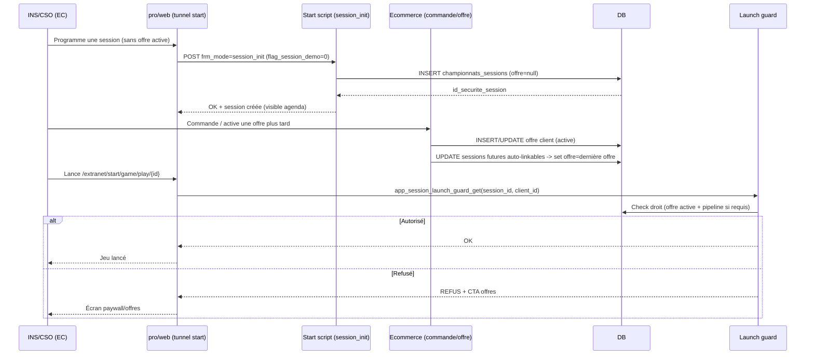

# Impacts non intentionnels d’un stock de sessions non liées à une offre client dans le repo pro

## Synthèse exécutive

La documentation canon (branche `develop`) décrit explicitement un changement d’architecture fonctionnelle : **la programmation** de sessions a été rendue possible **sans offre active**, et le verrou d’accès a été déplacé vers le **backend de lancement** via une fonction “source-of-truth” `app_session_launch_guard_get(...)` appliquée sur le handler de lancement, avec un écran de refus et un CTA vers les offres. Preuves : `https://raw.githubusercontent.com/cotton-games/documentation-public/refs/heads/develop/canon/repos/pro/sessions_scheduled_paywall_audit.md?v=b22dc189b09dc638191cc5f0ab6d50f578f21c4a` — section **“Patch implemented (2026-02-20)”**. citeturn2view2

Ce déplacement de verrou rend **structurellement possible** (et donc probable) l’existence en base d’un stock de **sessions futures orphelines** (non liées à une offre au moment de leur création), tout en conservant un blocage au moment du “Play”. Preuves : même source — sections **“Flow map”**, **“Matrice checks ‘offre active’ (actuel)”** et **“Patch implemented (2026-02-20)”**. citeturn2view2

Les impacts SI non intentionnels les plus sensibles de ces sessions “non liées” ne sont pas seulement “est-ce que le client peut jouer”, mais : (a) **cohérence de source-of-truth** entre pipeline CRM (INS/CSO/ABN/PAK) et offre e-commerce, (b) **attribution analytique** (par offre/plan), (c) **support/ops** (tickets, explications, rebooking), (d) **risques de bypass** si une route de lancement échappe au garde backend, et (e) **retrofit/migrations** pour rattacher automatiquement les sessions futures à la “dernière offre commandée” sans redéfinir rétroactivement l’intention métier. Preuves de base sur les axes “pipeline” et “offre active” : `ecommerce_ins_cso.md` — section **“Source of truth INS/CSO”** et `sessions_scheduled_paywall_audit.md` — sections **“Findings”** et **“Patch implemented (2026-02-20)”**. citeturn2view3turn2view2

Point d’attention majeur côté gouvernance : toute la documentation `canon/repos/pro/*` consultée est absente de `main` (404), ce qui constitue un **écart develop>main** au sens de la règle “main=prod / develop=WIP”. Preuves : `START.md` — section **“Statut actuel (important)”** et tests 404 sur `main/canon/repos/pro/*`. citeturn0view0turn13view0turn13view1turn13view2

## Sources, navigation agent-first et état de vérité

La navigation “agent-first” et la discipline “preuve d’abord” sont explicitement imposées : partir de `START.md`, puis ouvrir les sitemaps `SITEMAP.txt` / `SITEMAP.ndjson`, puis la carte repo, puis le manifest de routing. Preuves : `https://raw.githubusercontent.com/cotton-games/documentation-public/refs/heads/main/START.md` — section **“Parcours (sans supposition)”** et section **“Règle preuve d’abord (obligatoire)”**. citeturn0view0

Les index agent-first listent bien la carte repo `canon/repos/pro/INDEX.md` et les pages demandées (`sessions_scheduled_paywall_audit.md`, `ecommerce_ins_cso.md`, etc.). Preuves : `SITEMAP.txt` (develop) et `SITEMAP.ndjson` (develop). citeturn0view1turn14view0turn2view1

Convention de vérité : `main = état prod`, `develop = travail en cours` et tout audit doit comparer les **mêmes chemins**. Preuves : `START.md` — section **“Statut actuel (important) / Current status (important)”**. citeturn0view0

Écart constaté : `canon/repos/pro/*` n’existe pas en `main` (404), alors qu’il existe en `develop`. Preuves : 404 sur `main/canon/repos/pro/INDEX.md`, `main/canon/repos/pro/sessions_scheduled_paywall_audit.md`, `main/canon/repos/pro/ecommerce_ins_cso.md`. citeturn13view0turn13view1turn13view2  
Implication méthodologique : l’analyse ci-dessous est **prouvée** par la doc `develop` (canon), mais **non prouvée “prod-main”** via ces pages (elles n’y sont pas publiées). Preuve de la règle de conclusion (“Écart develop>main” vs “Aligné main=develop”) : `START.md` — section **“Comparer develop vs main”**. citeturn0view0

## Fonctionnement documenté du triangle pipeline, offre et session

### Ce que la doc prouve sur le pipeline INS/CSO/ABN/PAK

Le statut INS/CSO côté EC est dérivé d’une **clé de référentiel** : `clients.id_pipeline_etat` → `referentiels_clients_pipeline_etats(id, nom)`. Le code résout le nom via `client_pipeline_etat_get_nom(...)` (SQL `SELECT nom ...`). Preuve : `https://raw.githubusercontent.com/cotton-games/documentation-public/refs/heads/develop/canon/repos/pro/ecommerce_ins_cso.md?v=b22dc189b09dc638191cc5f0ab6d50f578f21c4a` — section **“Source of truth INS/CSO”**. citeturn2view3

La home “no-offer” et certains widgets sont explicitement ordonnés selon `client_pipeline_etat_nom` (INS vs CSO), ce qui confirme que le **pipeline est un driver UI**. Preuve : `home_widgets_ins_cso.md` — section **“Ordonnancement”**. citeturn19view0

**Non trouvé (au sens strict)** : dans les pages ouvertes, la *définition canon* des états `ABN` et `PAK` (sémantique exacte et mapping vers “offre active / payée / expirée”) n’est pas fournie. Les occurrences montrent qu’`ABN`/`PAK` existent comme valeurs de pipeline (ex. home ABN/PAK), mais le contrat “ABN ou PAK ⇒ droit de lancer une session” n’est pas explicitement spécifié dans une doc de règles d’accès. Preuves de présence ABN/PAK en home (sans règle d’accès) : `pro/HANDOFF.md` — section **“Home EC (`client_pipeline_etat_nom` vaut `ABN` ou `PAK`)”**. citeturn20view0

### Ce que la doc prouve sur “offre active” et création/lancement de session

Avant patch, un contrôle de “programmation” était effectué selon le nombre d’offres actives (`id_etat=3`) dans l’entrée EC (`pro/web/ec/ec.php`). Preuve : `sessions_scheduled_paywall_audit.md` — section **“Findings (preuves fichier:ligne)”**. citeturn2view2

La doc prouve que le handler de création est `session_init`, qu’il résout un `id_offre_client` via `app_ecommerce_offre_client_get_id`, puis écrit la session via `app_session_ajouter(...)` dans la table `championnats_sessions`. Preuve : même fichier — section **“Flow map → PROGRAMMER (hors démo)”**. citeturn2view2

La doc prouve aussi que la génération de lien `app_session_get_link(...)` gère principalement la chronologie (before/during/after) et “pas l’état actif offre”. Preuve : `sessions_scheduled_paywall_audit.md` — section **“Findings”** et **“Matrice checks ‘offre active’ (actuel)”**. citeturn2view2

Patch documenté (daté 2026-02-20) :  
- **Programmation autorisée sans offre active**, avec onboarding vers `choose/0` et `session_init` qui accepte un flux non-démo sans offre active.  
- **Garde-fou déplacé au lancement backend** via `app_session_launch_guard_get(...)` appliqué dans `ec_start_sessions_play_classic.php` avec écran de refus + CTA offres.  
Preuve : `sessions_scheduled_paywall_audit.md` — section **“Patch implemented (2026-02-20)”**. citeturn2view2

### Ce que la doc prouve sur le modèle DB (tableau global, sans colonnes détaillées)

Le schéma DB canon (MAP) liste à la fois le domaine sessions (dont `championnats_sessions`) et le domaine e-commerce (dont `ecommerce_offres_to_clients`, `ecommerce_commandes*`). Preuve : `https://raw.githubusercontent.com/cotton-games/documentation-public/refs/heads/develop/canon/data/schema/MAP.md?v=b22dc189b09dc638191cc5f0ab6d50f578f21c4a` — sections **“Ecommerce / offres / paiements”** et **“Equipes / championnats”**. citeturn5view0

**Non trouvé** : les **colonnes exactes** de `championnats_sessions` et de la table “offre client” permettant d’établir formellement le lien session↔offre (ex. un champ `offre_client_id`, `id_offre_client`, `id_securite_offre_client`, ou autre) ne sont pas récupérables depuis `DDL.sql` via les fenêtres accessibles au web agent ; seules les métadonnées de dump apparaissent. Dans ce périmètre, la preuve “table+colonne” exigée est donc “non trouvé”. Preuve de la source brute attendue (mais non exploitable ici) : `OVERVIEW.md` — section **“Périmètre”** (source brute = `DDL.sql`). citeturn5view1

## Impacts non intentionnels par dimension, preuves et mitigations

Le tableau ci-dessous résume la criticité/likelihood ; les détails par dimension suivent. citeturn2view2turn2view3turn5view0turn12view0turn16view0

| Dimension | Impact concret non intentionnel | Severity | Likelihood | Composants affectés (doc) | Mitigation principale |
|---|---|---|---|---|---|
| Data model | Sessions futures créées sans lien session↔offre (sessions “orphelines”) | High | High | `session_init`, `app_session_ajouter`, `championnats_sessions` | Introduire un lien explicite et une stratégie de rattachement auto (commande + fallback au lancement) |
| Access control | Incohérences pipeline (INS/ABN/PAK/CSO) vs offre active (`id_etat=3`) selon les surfaces | High | Medium | `ec.php` (onboarding), garde backend (lancement) | Unifier la décision d’accès sur une source-of-truth backend + logs décisionnels |
| Session lifecycle | États intermédiaires “programmée mais non lançable” → opérations ambiguës (duplication/suppression) | Medium | High | agenda `start/games`, `frm_mode` `session_delete`, etc. | Marquer explicitement l’état “lock” (et sa raison) dans l’agenda + règles de mutation |
| Billing/analytics | Impossible/difficile d’attribuer usage/revenu à une offre/plan si le lien est absent | Medium | Medium | reporting `reporting_games_sessions_detail` | Enrichir le dataset (ou un dataset parallèle) avec l’offre effective au lancement |
| UX/ops | Support accru (“je vois mes sessions mais je ne peux pas jouer”) + rebooking/réassurance | Medium | High | écran refus + CTA offres | Message cohérent partout (agenda, play) + guidance scripts support |
| Security | Risque de bypass si une route de lancement échappe au guard unique | High | Medium | routes `/extranet/start/game/play/{id}` + surfaces alternatives | Tests anti-bypass + monitoring 403/denied + intégration systématique du guard |
| Edge cases | Multi-offres + changement d’offre après programmation → rattachement surprenant | High | Medium | flows multi-offres, agenda quick | “Link policy” versionnée (source, date, mode) + règles de non-réécriture |
| Migration | Backfill/rattachement a posteriori potentiellement coûteux et sujet à erreurs | Medium | High | DB + e-commerce hooks | Job idempotent “attach future sessions” à l’activation d’offre + audit |
| Tests/monitoring | Régressions silencieuses (sessions orphelines, denies) si non observées | High | High | logs/telemetry | KPIs et alertes (orphans, denied reasons, conversion de rattachement) |

### Data model

**Preuves disponibles (tables & points de write)**  
- Sessions : la création `session_init` écrit via `app_session_ajouter(...)` dans `championnats_sessions`. Preuve : `sessions_scheduled_paywall_audit.md` — section **“Flow map → PROGRAMMER (hors démo)”**. citeturn2view2  
- E-commerce “offre client” : table listée `ecommerce_offres_to_clients` et son FK logique `ecommerce_offres_to_clients.client_id → clients.id`. Preuve : `MAP.md` — section **“Ecommerce / offres / paiements”**. citeturn5view0

**Non trouvé (champs exacts session↔offre)**  
- Les colonnes précises en DB reliant une session à une offre (ex. `championnats_sessions.*_offre_*`) ne sont pas visibles depuis `DDL.sql` dans les pages ouvertes (la preuve “table.colonne” n’est donc pas disponible). Preuve de la source attendue : `OVERVIEW.md` — section **“Périmètre”** (DDL = source brute). citeturn5view1

**Impacts SI non intentionnels (concrets)**  
- Fragilité du SI dès qu’un traitement suppose une valeur non nulle : exports, écrans agenda, ou contrôles backend peuvent devoir gérer des cas “null / inconnu / non résolu” en plus du nominal. Cette situation devient “by design” avec la programmation sans offre active. Preuve du changement “programmation autorisée sans offre active” : `sessions_scheduled_paywall_audit.md` — section **“Patch implemented (2026-02-20)”**. citeturn2view2  
- Complexification du “contrat d’authz” : si l’accès est décidé au lancement, mais que l’offre n’est pas stockée sur la session (ou est stockée tard), l’audit “pourquoi cette session a été refusée/acceptée” devient plus difficile sans journalisation. La doc insiste sur une source-of-truth backend au lancement, mais n’explicite pas la trace. Preuve du move guard backend : même section “Patch implemented (2026-02-20)”. citeturn2view2

**Mitigations proposées (nécessitent audit Codex pour champs DB non trouvés)**  
- Introduire/officialiser un lien explicite session→offre “effective” + métadonnées (mode de link : `auto_on_order | auto_on_launch | manual`, timestamp, raison). Cela réduit (a) les joins incertains et (b) les reconstructions implicites. **Audit Codex requis** pour confirmer les champs existants et éviter doublons. Preuve de la règle “si info structurelle manque → demander un audit Codex” : `DOCS_MANIFEST.md` — section **“AI workflow rule (roles)”**. citeturn2view0

### Access control flow

**Preuves disponibles (où l’on check quoi)**  
La doc cartographie plusieurs checks “offre active” avant patch :  
- Onboarding “Programmer” conditionné au nombre d’offres actives (`id_etat=3`) dans `ec.php`.  
- UI carte agenda (sessions programmées) : calcul d’accès + logique `date_fin ABN` + CTA “Je renouvelle mon offre”.  
- Backends : `session_init` fait une résolution offre partielle (existence id_securite → id_offre_client) mais “sans check explicite active” (dans la matrice).  
Preuve : `sessions_scheduled_paywall_audit.md` — sections **“Findings”**, **“Matrice checks ‘offre active’ (actuel)”**. citeturn2view2

En parallèle, le pipeline INS/CSO est un référentiel dérivé de `clients.id_pipeline_etat`. Preuve : `ecommerce_ins_cso.md` — section **“Source of truth INS/CSO”**. citeturn2view3

Enfin, le patch crée une décision au lancement via `app_session_launch_guard_get(...)` et l’applique au handler de play classique. Preuve : `sessions_scheduled_paywall_audit.md` — section **“Patch implemented (2026-02-20)”**. citeturn2view2

**Non trouvé (règles exactes du guard et mapping ABN/PAK)**  
- La doc prouve l’existence du guard, mais ne publie pas son **algorithme** (quels critères : pipeline ? offre active ? les deux ? quelles priorités ?). “app_session_launch_guard docs” dédiées : non trouvé dans l’index `canon/repos/pro/INDEX.md`. Preuve index : `pro/INDEX.md` — section **“Pages”** (liste finite). citeturn2view1

**Impacts SI non intentionnels (concrets)**  
- Risque de “drift” si certaines surfaces pilotent l’UX via pipeline (INS/CSO/ABN/PAK) tandis que l’accès réel est piloté via l’offre active (ou inversement). Dans ce cas, on peut afficher un état UI trompeur (“tu peux” / “tu ne peux pas”). Preuves d’usage pipeline en home + usage offre active dans onboarding : `home_widgets_ins_cso.md` — section “Ordonnancement” et `sessions_scheduled_paywall_audit.md` — section “Findings”. citeturn19view0turn2view2  
- Risque d’incohérence si un chemin de lancement contourne le guard : l’audit a déjà identifié une surface alternative (widget agenda) qui pointait directement vers `app_session_get_link(...)` sans garde-fou UI local. Preuve : `sessions_scheduled_paywall_audit.md` — section **“Findings”** (surface alternative widget agenda). citeturn2view2

**Mitigations proposées**  
- Poser un principe contractuel : **toute** route de lancement doit passer par le même guard backend, et l’UX doit se caler sur la décision du guard (via un endpoint/flag commun). Cette intention est déjà décrite (“source-of-truth” backend). Preuve : `sessions_scheduled_paywall_audit.md` — section **“Candidate patch points”** et patch “garde-fou déplacé”. citeturn2view2  
- Instrumenter la décision (raison, pipeline, offre effective) via logs structurés JSONL afin que support/ops puisse expliquer un refus. Preuves de schéma logs canon (JSONL + viewer) : `logging.md` — sections **“Schéma”** et **“Conventions minimales recommandées”**. citeturn16view0

### Session lifecycle

**Preuves disponibles (actions & routage pro)**  
La carte repo `pro` documente explicitement le tunnel “start session / démo” avec des routes et une liste de `frm_mode` (dont `session_init`, `session_duplicate`, `session_delete`, et les modes multi-dates). Preuve : `pro/README.md` — section **“Tunnel start session / démo”**. citeturn11view0

L’audit “offre active” documente la portion lifecycle “PROGRAMMER” vs “LANCER/JOUER” : création via `session_init` et lancement via `/extranet/start/game/play/{id}` (route `.htaccess` + handler `ec_start_sessions_play_classic.php`). Preuve : `sessions_scheduled_paywall_audit.md` — section **“Flow map”**. citeturn2view2

**Non trouvé (annulation/rebooking dépendants de l’offre)**  
- La doc ouverte ne décrit pas de règle canon “l’offre compte pour annuler/rebook / dupliquer”, ni la politique de mutation de session quand l’accès est verrouillé. Côté `frm_mode`, l’existence de `session_delete` est prouvée, mais pas son interaction avec l’offre. Preuve de la liste des `frm_mode` sans règle d’offre : `pro/README.md` — section “Tunnel start session / démo”. citeturn11view0

**Impacts SI non intentionnels (concrets)**  
- Nouvel état intermédiaire : “session programmée (visible dans l’agenda) mais non lançable” si le guard bloque. Cela augmente le nombre de transitions à traiter “sans bug” (ex. suppression, duplication, multi-dates). Preuves “programmation sans offre active” + “refus au lancement avec écran CTA offres” : `sessions_scheduled_paywall_audit.md` — section “Patch implemented (2026-02-20)”. citeturn2view2  
- Cascades d’effets sur le multi-dates (“agenda quick”) : si une création batch produit N sessions futures, un rattachement a posteriori doit être atomique/idempotent pour éviter des états mélangés (une partie rattachée, une partie non). La doc prouve l’existence d’un flux batch/multi-dates, pas sa règle d’offre. Preuve du flux multi-dates : `pro/README.md` — section “Tunnel start session / démo” (modes `session_setting_multi`, `resume-batch`). citeturn11view0

**Mitigations proposées**  
- Introduire un état fonctionnel “lock_reason” dérivé du guard, exposé dans l’agenda (ex. `NO_ACTIVE_OFFER`, `PIPELINE_NOT_ALLOWED`, `OFFER_EXPIRED`) afin de guider l’utilisateur avant le clic “Play”. Preuve que l’audit recommande un état cohérent issu du backend : `sessions_scheduled_paywall_audit.md` — section **“Candidate patch points”**. citeturn2view2  
- Définir une politique de mutation : suppression/duplication autorisées même si locked (ou non), et documenter. **Non trouvé** dans la doc ; à expliciter via mise à jour canon si implémenté. Preuve d’obligation de tenir la doc canon à jour en cas de changement fonctionnel : `DOCS_MANIFEST.md` — section **“Update triggers (mapping)”**. citeturn2view0

### Billing, reporting et analytics

**Preuves disponibles (reporting actuel)**  
Le reporting BO “jeux & joueurs” repose notamment sur `reporting_games_sessions_detail` recalculé sur une fenêtre M-1/M, avec colonnes : `session_id` (token `championnats_sessions.id_securite`), `session_date`, `id_client`, `id_type_produit`, `players_count`. Aucune colonne “offre” n’est mentionnée dans ce dataset canon. Preuve : `games-reporting.md` — sections **“Tables”** et **“Drilldown BO”**. citeturn12view0

**Non trouvé (attribution CA à l’offre)**  
- Aucune règle canon ouverte ne décrit une attribution financière (facturation/revenu) “session jouée → offre/commande”. La doc mentionne un router BO `facturation_pivot_saas_handle_games_sessions_detail_ajax`, mais sans logique d’offre. Preuve : `games-reporting.md` — section “Router BO”. citeturn12view0

**Impacts SI non intentionnels (concrets)**  
- Si le produit a besoin de segmenter l’usage par “offre/plan”, l’absence de lien session↔offre implique soit une reconstruction indirecte (join par client et dates), soit un enrichissement des tables de reporting. Dans les deux cas : risque de divergences analytiques et d’audits difficiles, surtout avec des changements d’offre a posteriori. Preuves de l’absence de colonne offre + existence de sessions non liées initialement : `games-reporting.md` (colonnes) et `sessions_scheduled_paywall_audit.md` (programmation sans offre). citeturn12view0turn2view2

**Mitigations proposées**  
- Ajouter une dimension d’offre “effective au lancement” (ex. `offer_client_id_effective`) au dataset de détail (ou dataset parallèle), figée à la date de jeu. Cela évite que le “dernier achat” réécrive l’historique analytique. Preuve que `reporting_games_sessions_detail` est “figé par session” (intention de figer) : `games-reporting.md` — section **“Nouveau reporting_games_sessions_detail (figé par session)”**. citeturn12view0

### UX et opérations

**Preuves disponibles**  
- Les flows “no-offer” côté home EC sont explicitement traités par widgets : découverte jeux + widget CSO “choisir une offre”, ordonnés selon pipeline INS/CSO. Preuve : `home_widgets_ins_cso.md` — sections **“Objectif”**, **“Ordonnancement”**, **“Widget CSO ‘Choisir une offre’”**. citeturn19view0  
- Côté session launch, un écran de refus + CTA offres a été ajouté dans le handler de play classique. Preuve : `sessions_scheduled_paywall_audit.md` — section **“Patch implemented (2026-02-20)”**. citeturn2view2

**Non trouvé (process support / remboursement)**  
- Aucune procédure canon ouverte n’explique comment le support doit traiter “session programmée mais verrouillée” (remboursement, geste, rebooking). Non trouvé.

**Impacts SI non intentionnels (concrets)**  
- Augmentation des tickets : le même utilisateur peut percevoir une contradiction (“je programme” vs “je ne peux pas jouer”). Ce risque est intrinsèque dès lors que la doc autorise la programmation sans offre active (et bloque au lancement). Preuve : `sessions_scheduled_paywall_audit.md` — section “Patch implemented (2026-02-20)”. citeturn2view2  
- Risque d’UX incohérente si la home (pipeline) et l’agenda (offre active) ne convergent pas sur la même explication et le même CTA. Preuves de pipeline driver home + offre active driver historique onboarding : `home_widgets_ins_cso.md` et `sessions_scheduled_paywall_audit.md`. citeturn19view0turn2view2

**Mitigations proposées**  
- Uniformiser le messaging : exposer la raison du lock, et offrir un CTA unique vers la page offres (déjà un objectif des widgets CSO et du refus de lancement). Preuves : `home_widgets_ins_cso.md` (CTA “Je choisis mon offre”) et `sessions_scheduled_paywall_audit.md` (CTA offres au refus play). citeturn19view0turn2view2

### Risques sécurité et autorisation

**Preuves disponibles**  
L’audit identifie explicitement des zones à risque et des non-régressions : “accès direct URL launcher/play”, surfaces UI divergentes, multi-jeux car `app_session_get_link` est partagé. Preuve : `sessions_scheduled_paywall_audit.md` — section **“Risques / non-régression”** et mention du widget agenda pointant directement sur `app_session_get_link(...)`. citeturn2view2

La doc canon sur logging/telemetry précise qu’on peut rendre une session retraçable via JSONL, viewer, et événements front de telemetry. Preuves : `logging.md` et `games-telemetry.md`. citeturn16view0turn16view1

**Non trouvé**  
- Threat model exhaustif sur les identifiants de session côté pro (ex. entropie de `id_securite`, exposition d’URL) : non trouvé dans les pages ouvertes.

**Impacts SI non intentionnels (concrets)**  
- Si une route ou un widget réintroduit un lien direct vers un launcher non gardé, le verrou “au lancement” peut être contourné. L’audit montre qu’une divergence a déjà existé (widget agenda). Preuve : `sessions_scheduled_paywall_audit.md` — section “Findings”. citeturn2view2

**Mitigations proposées**  
- Tests anti-bypass systématiques et monitoring “denied vs allowed” (plus bas). La doc canon fournit un cadre de logs/telemetry réutilisable. Preuves : `sessions_scheduled_paywall_audit.md` (risques) + `logging.md`/`games-telemetry.md` (observabilité). citeturn2view2turn16view0turn16view1

### Edge cases

**Preuves disponibles (edge cases explicitement listés)**  
L’audit liste des non-régressions : démo vs non-démo (`flag_session_demo`), accès direct URL launcher/play, multi-jeux et cohérence old/new launchers, et des types produit. Preuve : `sessions_scheduled_paywall_audit.md` — section **“Risques / non-régression à couvrir”**. citeturn2view2

**Non trouvé**  
- Politique canon “multi-offres” au sens e-commerce : si un client commande plusieurs offres, quelles sessions futures basculent, et quand. La doc pro décrit des parcours multi-offres côté agenda quick, mais pas la règle contractuelle de rattachement “dernière offre” (c’est ici une exigence utilisateur, pas une preuve doc). Preuve de l’existence d’un parcours multi-offres (sans règle de rattachement) : `pro/README.md` — section “Tunnel start session / démo” (mention “en multi-offres: start/game/offres/0… puis choix offre + jeu”). citeturn11view0

**Impacts SI non intentionnels (concrets)**  
- “Dernière offre commandée” peut être une règle surprenante si des sessions ont été programmées avec une intention implicite (ex. une campagne liée à une formule) puis le client change de plan. L’absence de lien explicite sur la session rend cette intention non audit-able. Preuves : programmation sans offre + existence de multi-offres dans parcours. citeturn2view2turn11view0

**Mitigations proposées**  
- Versionner la politique de link sur la session (source + timestamp + “auto-linkable” bool) : cela permet de ne pas réécrire certaines sessions si elles ont été “explicitement rattachées” (manuel) vs “auto”. **Champs DB non trouvés → audit Codex requis**. Preuve de l’exigence “no guessing / audit Codex si info structurelle manque” : `DOCS_MANIFEST.md` — section **“AI workflow rule (roles)”**. citeturn2view0

### Migration et retrofit

**Preuves disponibles**  
- La doc prouve qu’après patch (2026-02-20) on peut créer des sessions sans offre active, donc un backfill/rattachement devient potentiellement nécessaire pour répondre à une règle business “relier après commande”. Preuve : `sessions_scheduled_paywall_audit.md` — section “Patch implemented (2026-02-20)”. citeturn2view2

**Non trouvé**  
- Aucun job/cron canon “attach sessions to last offer” n’est documenté dans les pages ouvertes (ni dans les docs pro listées par l’index). Preuve index de pages disponibles : `pro/INDEX.md` — section “Pages”. citeturn2view1

**Impacts SI non intentionnels (concrets)**  
- Risque de dette de données : accumulation de sessions futures non rattachées qui rendent support, analytique, et debugging plus coûteux. Cette dette est mécaniquement probable si la programmation sans offre est utilisée mais que l’événement “commande” ne rattache pas. Preuve de la programmation sans offre (cause) : `sessions_scheduled_paywall_audit.md` — section “Patch implemented (2026-02-20)”. citeturn2view2

**Mitigations proposées**  
- Implémenter un rattachement idempotent à l’activation d’une offre (événement “order paid / offer activated”), et compléter par un fallback au premier lancement réussi si besoin. La doc ne donne pas le hook exact : **audit Codex required**. Preuve de la règle “routing anti-rescan + changed files + docs à ouvrir” et nécessité de Codex pour les détails manquants : `DOCS_MANIFEST.md` — sections **“Procédure anti-rescan (Codex)”** et **“AI workflow rule (roles)”**. citeturn2view0

## Stratégie recommandée pour “rattacher toutes les futures sessions à la dernière offre commandée”

### Principe de décision

Objectif produit (donné par le contexte utilisateur) :  
- Relier systématiquement les **futures sessions** d’un INS/CSO à la **dernière offre commandée** si la commande a lieu après la programmation.  
- Et au lancement, vérifier que l’utilisateur est toujours **ABN ou PAK** (ou, plus généralement, qu’il a une offre valide), sinon couper l’accès et renvoyer vers les offres.

La doc permet de s’aligner sur un système “programmation permissive / lancement gardé” ; c’est un cadre cohérent avec le patch “garde-fou au lancement backend”. Preuve : `sessions_scheduled_paywall_audit.md` — section “Patch implemented (2026-02-20)”. citeturn2view2

### Algorithme de rattachement

**Étape A — Au moment de la commande (source la plus propre)**  
1) Identifier l’“offre client” nouvellement activée (contrat `id_etat=3` existe pour “offre active” mais le mapping exact est à confirmer). Preuve de l’usage `id_etat=3` pour “offres actives” côté pro : `sessions_scheduled_paywall_audit.md` — section “Findings”. citeturn2view2  
2) Mettre à jour toutes les sessions futures du client qui sont “auto-linkables” : `offer_client_id = last_offer_client_id`.  
3) Journaliser l’opération (nombre de sessions impactées, offer id) via logs structurés. Preuve du cadre logs canon : `logging.md` — section “Schéma”. citeturn16view0

**Étape B — Au lancement (fallback de sécurité & cohérence)**  
- Si la session n’a pas d’offre liée, utiliser la “dernière offre active” au moment du lancement et rattacher “à la volée” (optionnel) *après* validation du droit, puis lancer. Preuve qu’il existe un guard backend donné comme “source-of-truth” au lancement : `sessions_scheduled_paywall_audit.md` — section “Patch implemented (2026-02-20)”. citeturn2view2

**Pré-requis (non trouvés → audit Codex)**  
- Champs DB exacts à mettre à jour sur `championnats_sessions`. (Non trouvé via `DDL.sql` accessible.) citeturn5view1  
- Hook e-commerce exact et table “offre client” : la table `ecommerce_offres_to_clients` existe (MAP) mais les champs d’état/date et le moment “activation” ne sont pas documentés ici. citeturn5view0

### Diagramme de séquence demandé

La présence des éléments “programmation sans offre” + “lancement via /extranet/start/game/play/{id}” + “garde-fou au lancement backend” est documentée. Preuve : `sessions_scheduled_paywall_audit.md` — sections “Flow map” et “Patch implemented (2026-02-20)”. citeturn2view2

## Checklist d’implémentation, tests minimaux et monitoring

### Checklist d’implémentation

Cette checklist inclut **obligatoirement** la discipline doc à appliquer dans tout prompt à un agent IDE (Codex), conformément au manifest. Preuve : `DOCS_MANIFEST.md` — sections **“Snippet à coller…”** et **“Procédure anti-rescan (Codex)”**. citeturn2view0

1) **Audit Codex (obligatoire, car “non trouvé” sur les champs DB et hooks e-commerce)**  
   - Extraire les champs exacts de `championnats_sessions` liés à l’offre (ou confirmer qu’ils n’existent pas).  
   - Identifier la table exacte et le modèle d’état d’une “offre client” (probablement `ecommerce_offres_to_clients`) et quand une offre devient “dernière offre commandée” (payée vs active).  
   - Documenter l’implémentation exacte de `app_session_launch_guard_get(...)` (règles pipeline vs offre).  
   Justification : le manifest demande un audit quand l’info structurelle manque. Preuve : `DOCS_MANIFEST.md` — section “AI workflow rule (roles)”. citeturn2view0

2) **Définir le contrat métier “dernière offre”**  
   - Définir la notion “dernière offre commandée” : dernière offre payée ? dernière offre active (`id_etat=3`) ? cas des offres expirées.  
   - Documenter la règle dans `canon/repos/pro/README.md` si c’est un changement fonctionnel. Preuve d’obligation doc pro en cas de changement fonctionnel : `pro/README.md` — section “Doc discipline”. citeturn11view0

3) **Implémenter l’auto-rattachement côté e-commerce**  
   - Sur l’événement “offre activée” : rattacher les sessions futures auto-linkables.  
   - Ajouter un mécanisme idempotent (rejouable) et journalisé.

4) **Fallback au lancement et garde unique**  
   - Vérifier que toutes les routes de lancement funnelent vers `/extranet/start/game/play/{id}` et passent par `app_session_launch_guard_get(...)`. Preuve que l’uniformisation UI et la route play classique sont des pivot points : `sessions_scheduled_paywall_audit.md` — sections “Flow map” et “Patch implemented (2026-02-20)”. citeturn2view2

5) **Mise à jour documentation obligatoire (à inclure dans tous prompts Codex)**  
   - Mettre à jour `canon/repos/pro/TASKS.md` (update-not-append si tâche existante).  
   - Si changement fonctionnel : mettre à jour `canon/repos/pro/README.md`.  
   - Mettre à jour `HANDOFF.md` (toujours).  
   - Régénérer `SITEMAP.md` via `npm run docs:sitemap`.  
   Preuves : `DOCS_MANIFEST.md` — sections “Snippet à coller…” et “Post-edit required actions”. citeturn2view0

### Tests automatisés minimaux

Les tests ci-dessous visent à couvrir les risques explicitement listés (démo vs non-démo, accès direct URL, multi-jeux) et les invariants du rattachement. Preuve de la liste de risques non-régression : `sessions_scheduled_paywall_audit.md` — section “Risques / non-régression à couvrir”. citeturn2view2

- **Test création sans offre** : un client sans offre active peut créer une session non-démo (comportement attendu par patch) et la session est marquée “non liée”. Preuve de l’acceptation du flux non-démo sans offre active : `sessions_scheduled_paywall_audit.md` — section “Patch implemented (2026-02-20)”. citeturn2view2  
- **Test activation offre → rattachement** : après activation d’une offre, toutes les sessions futures auto-linkables sont rattachées à cette offre (idempotent si rejoué). (Règle produit, non prouvée dans doc : à implémenter et documenter.)  
- **Test launch guard deny** : session future + client sans droit ⇒ refus + CTA offres. Preuve de “refus + CTA offres au play classique” : `sessions_scheduled_paywall_audit.md` — section “Patch implemented (2026-02-20)”. citeturn2view2  
- **Test anti-bypass** : accès direct à toute URL de lancement historique/secondaire doit être aligné au guard (ou rediriger vers la route gardée). Preuve du risque “accès direct URL launcher/play” + surfaces divergentes : `sessions_scheduled_paywall_audit.md` — section “Risques / non-régression” et “Findings”. citeturn2view2  
- **Test reporting** (optionnel mais recommandé) : si vous enrichissez un dataset BO, vérifier que l’offre effective est figée par session et stable. Preuve que `reporting_games_sessions_detail` est figé par session : `games-reporting.md` — section “Nouveau reporting_games_sessions_detail (figé par session)”. citeturn12view0

### Monitoring et alertes

Le monitoring doit s’appuyer sur le cadre canon de logs JSONL et (si pertinent côté front) sur la telemetry. Preuves : `logging.md` et `games-telemetry.md`. citeturn16view0turn16view1

- **Alerte “sessions futures orphelines”** : nombre de sessions futures dont `offer_client_id` est null (ou équivalent) au-delà d’un seuil. Objectif : détecter un hook e-commerce cassé. (Champs exacts non trouvés → audit Codex). citeturn5view1turn2view0  
- **Alerte “launch denied rate”** : taux de refus par `app_session_launch_guard_get` (catégoriser les raisons). Objectif : repérer une désynchro pipeline/offre ou une expiration massive. Preuve que le guard est la source-of-truth de lancement (post-patch) : `sessions_scheduled_paywall_audit.md` — section “Patch implemented (2026-02-20)”. citeturn2view2  
- **Alerte “bypass suspicion”** : tentatives de lancement via routes non attendues (si existantes) ou absence de logs “guard_checked” sur un lancement réussi. La doc recommande une traçabilité par session via logs. Preuve de l’objectif “session retraçable” : `logging.md` — introduction (objectif JSONL + viewer). citeturn16view0  
- **Alerte “mismatch UX vs authz”** : si l’UI affiche une action “Play” mais que le guard refuse (ou inversement). La doc souligne le risque de surfaces divergentes et l’objectif d’harmonisation. Preuve : `sessions_scheduled_paywall_audit.md` — section “Candidate patch points” et mention de surface alternative. citeturn2view2

### Note de conformité “preuves d’abord” pour ce rapport

- Les règles de navigation agent-first et la discipline “citer URL RAW + section, sinon ‘non trouvé’” sont elles-mêmes codifiées dans `START.md`. Preuve : `https://raw.githubusercontent.com/cotton-games/documentation-public/refs/heads/main/START.md` — section “Règle preuve d’abord (obligatoire)”. citeturn0view0  
- Les sources ont été ouvertes depuis `raw.githubusercontent.com` hébergé par entity["company","GitHub","code hosting platform"], pour le dépôt public de entity["company","Cotton Games","game studio"]. Preuves : sitemaps raw (`SITEMAP.txt`, `SITEMAP.ndjson`) et index pro. citeturn0view1turn14view0turn2view1