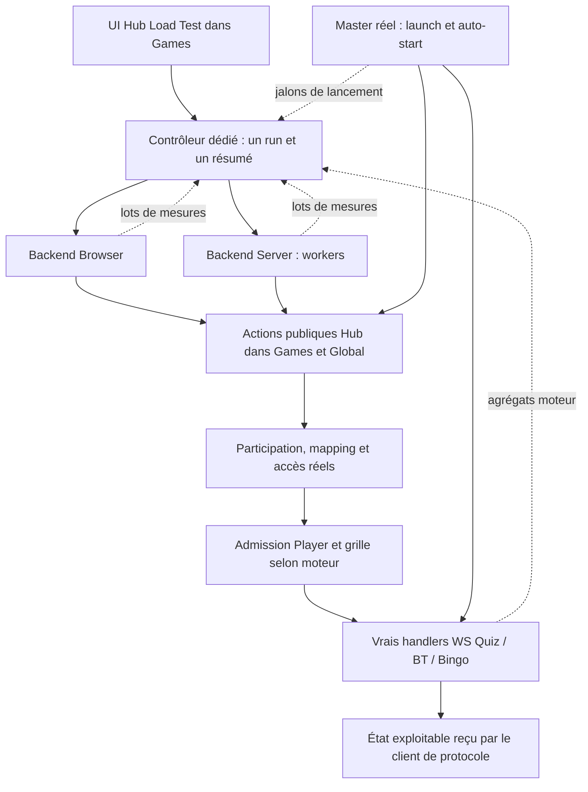

# Hub Load Test unique — audit et conception, 22/09/2026

<!-- AUTO-UPDATE:BEGIN id="hub-loadtest-unified-design-20260922" owner="codex" -->

Suite de cet audit : [premier lot Browser Quiz implémenté localement](hub-test-browser-delivery-2026-09-22.md), [contrat effectif](../canon/interfaces/hub-bot-test-runner.md). Le texte de conception ci-dessous reste historique ; le contrôleur v1 vit dans le navigateur, Server/BT/Bingo restent futurs. Aucun déploiement de ce nouveau lot.

**MODÈLE HUB UNIQUE RECOMMANDÉ.** Un scénario Hub, deux backends de génération, un contrôleur et un contrat de mesure. Les outils moteur directs restent des diagnostics avancés et des supports de régression ; ils ne qualifient plus la montée en charge du parcours utilisateur.

**Audit local uniquement.** Aucun patch applicatif, marker, restart, déploiement, requête DEV/DB ou charge réelle. Les noms de champs, événements et composants proposés ci-dessous sont une conception, pas des interfaces déjà disponibles. Aucun sas implémenté. Documentation seule modifiée.

## 1. État observé et portée des preuves

Les quatre worktrees sont désormais sur `sas_players`, y compris Games, contrairement au constat plus ancien où Games était sur `hub_soiree`. Le nom de branche ne démontre ni le contenu déployé ni sa présence dans un processus chargé.

| Repo | LOCAL sas_players, HEAD relevé | Patch instrumentation local | Patch performance local | DEV vérifié |
|---|---|---|---|---|
| Games | `b4609aa4d7d86aaed8c04c0344aca67341bfeb55` | Export/vérification A/B et tests non commités ; aucune instrumentation unifiée Hub | Diff branche vs `hub_soiree` : trois fichiers de tests capacité, pas de patch runtime Hub de ce lot | Pas de preuve de parité source ; logs Hub346 disponibles |
| Quiz | `74b99c90a69d9c94de98e69b9abb79b5c1e7e3ea` | loadtest, collecteur, handler, envUtils, logger, marker modifiés/non commités | Cohortes capacité dans HEAD ; import dans envUtils complet | **DEV Quiz réellement déployé : partie de l’instrumentation déclarée et WS redémarré** ; écoute3032 et trafic observés. Contenu exact des fichiers/processus non attesté |
| Blind Test | `1a76a66983c0527092d0c75fc5b475a5c09f4896` | Même socle + hooks publication/messaging/tests | Cohortes capacité + index publication dans HEAD | **DEV BT non vérifié/non livré** pour ce dernier lot selon opérateur |
| Bingo | `06b96758580b05291f0701ec481cdf46dd07afed` | Collecteur, générateur, serveur, queue, envUtils, repository, transport, tests et marker | Routage auth, retrait lecture reset externe et state Hub allégé + capacité | **DEV Bingo non vérifié/non livré** pour ce dernier lot selon opérateur |

Les fichiers instrumentés des branches performance contiennent aussi le métier commité. Ne jamais livrer une liste de « fichiers non commités » comme preuve d’instrumentation seule. L’incident Quiz l’a démontré. Aucun sas runtime déployé selon opérateur. Les sources Global lues pour les frontières Hub sont **locales**, sans assertion sur leur parité DEV.

La trace Hub346/session27950 est une recette fonctionnelle, pas une baseline de latence : WS rétabli à15:27:05 Paris ; 50 identités liées entre15:31:16.277 et15:31:34.955, 50 états envoyés et50 réponses traitées ; neuf refus session absente avant création runtime ; aucun `LOADTEST_*`. Les 18,678s entre premier et dernier bind ne mesurent ni launch→ready ni un percentile. Dernière entrée WS13:31:41.095Z. Voir [contrôle terrain](ws-loadtest-ab-instrumentation-2026-09-22.md#contrôle-terrain-hub346--50-bots-22092026).

## 2. Sources de code et architecture actuelle

Références ci-dessous : chemins relatifs à `/home/romain/Cotton`, numéros de lignes de cette lecture locale. Les plages servent à retrouver les fonctions ; le code fait autorité en cas de déplacement.

| Réf. | Source inspectée | Fait établi |
|---|---|---|
| S1 | `games/web/test_bots.php:2090–2255` | Mode Hub choisi avant le seuil session ; `CottonHubBots.create`, factories navigateur. Session Quiz/BT et Bingo : délégation serveur seulement si N>200 |
| S2 | `games/web/includes/bots/hub_bots.js:10–112` | 1–200 ; identités **localStorage** fourni par S1 ; current_player/register_guest, boucle séquentielle par joueur ; délai5000ms après fin de boucle ; re-attach si handle mort |
| S3 | `games/web/test_bots.php:1020–1089,1158–1208,1354–1376,1510–1548,1609–1638,1720–1745` | Q/BT Hub réutilise `hubProfile.playerId`, saute son inscription HTTP ; refus WS ferme le handle. Bingo conserve player_register/grid_assign et grid_hydrate décalé ; timeout historique désactivé à l’envoi auth, donc à corriger lors de l’absorption |
| S4 | `games/web/modules/app_hub_view_helpers.php:2951–2995,3128–3179,12688–12797` | Actions Hub launch/poll ; le poll réel passe par le résolveur complet et compose le programme/présentation ; watcher réel individuel3,5s après réponse, une requête en vol, navigation Player |
| S5 | `global/web/app/modules/jeux/hubs/app_games_hubs_functions.php:8919–9240,9257–9480,10724–10810` | Participation ensure, verrou Hub/session/joueur, preload, player_register interne, mapping ; contrôles focus/left/terminaison, résolution accès ; le poll peut réaliser les writes avant de retourner la détection au client |
| S6 | même fichier Global `:4630–4704,10195–10615` | Launch officiel, commit focus vérifié, exécution/routing, profil du lancement ; focus avant disponibilité du runtime WS possible |
| S7 | `games/web/includes/canvas/play/register.js:2586–2838,2849–2960` ; `play/play-ws.js:1064–1127,1262–1307,1638–1710` | Vrai Player : auto-register/restauration, admission PHP, grille Bingo, événement **pré-WS** `player/ready`, puis WS ; ACK Q/BT déclenche getGameState ; state Bingo interprété avec phase/génération |
| S8 | `quiz/web/server/actions/registration.js:62–280,450–686` ; BT `actions/registration.js:69–288,450–688` | Runtime créé à registerOrganizer, puis restauration asynchrone ; bind joueur et ACK avant publication différée. Session absente : registrationError **sans code machine** |
| S9 | Quiz `actions/gameplay.js:680–761` ; BT `actions/gameplay.js` getGameState ; BT `actions/registration.js:679` et `features.js` | État initial individuel après recherche socket bindé ; BT team capability après ACK, équipes désactivées localement |
| S10 | `games/web/includes/canvas/core/boot_organizer.js:1644–1746,1795–1818` ; `core/session_sync.js:119–160,269` | Hub attend organizer runtime, puis beginPlayFlow ; auto-start sans attendre joueurs ; reset Bingo phase1/clear_players:false avant play, également branché à game/init |
| S11 | `bingo.game/ws/bingo_server.js:785–964,1669–1690,4025` ; `ws/bingo_reset.js:47–107` | Auth/routage, queue playlist, lifecycle/capacité, addPlayer, lecture état puis state, vérification reset après opération ; bind seul insuffisant |
| S12 | `quiz/web/server/actions/loadtest_metrics.js:12–166` (copies BT/Bingo) | ALS et registre de runs **dans le même processus**, tentative unique, résumé figé, arrays de samples, stop/drain ; pas agrégateur cross-process |
| S13 | Q/BT `actions/loadtest.js` ; Bingo `ws/bingo_loadtest.js:105–224,993–1026` | Générateurs natifs cold/profiles 1–5000 ; vraies I/O mais absence du parcours public Hub ; queue de préparation Bingo distincte de queue moteur |
| S14 | BT `actions/gameplay.js:1259–1353`, `messaging.js` ; Bingo `ws/repository/db/db_player_repository.js:14,26,128`, `websocket_server.js`, `envUtils.js` | Points existants de mesure publication, bytes, routage/auth/state/I/O, à rattacher au nouveau contexte |

Audits antérieurs réutilisés : [pipeline d’inscription](hub-player-registration-pipeline-audit-2026-09-22.md), [outils natifs](ws-native-loadtools-audit-2026-09-22.md), [contrat A/B](ws-loadtest-ab-instrumentation-2026-09-22.md). La recommandation historique de qualifier les moteurs séparément du Hub est **remplacée pour la qualification produit** par cette conception. Les diagnostics moteur restent utiles. Corriger aussi l’ancienne mention « sessionStorage » des identités Hub : l’appel actuel fournit localStorage.

Tous les bots utilisent le WS métier, même sous200. Le seuil change le générateur, pas la présence d’un WS. Le mode Hub ne traverse jamais la bascule session >200. Augmenter le volume dans l’UI actuelle ne suffit pas à créer un run Hub serveur.

## 3. Inventaire : réutiliser, adapter, déprécier

| Brique | À conserver | Adaptation nécessaire au Hub unique |
|---|---|---|
| run_id | UUID et corrélation explicite | Fourni par contrôleur, partagé ; plus créé indépendamment par chaque moteur |
| attempt_id | Identifiant sans données personnelles | Séparer `subject_slot` stable du joueur, `journey_id` session/exécution, `attempt_seq` de retry ; une erreur de tentative ne termine pas le joueur |
| Percentiles | Durées monotones et calcul final nearest-rank | Ajouter p90 ; conserver dénominateur demandé et censures ; merge des distributions, jamais moyenne de percentiles |
| Process sampling | CPU, heap/RSS, lag, bufferedAmount | Distinguer moteur/générateur/contrôleur ; sampling borné ; supprimer copie du tableau N et scan timeout complet à chaque seconde au profit d’échéances/curseur |
| Capacité B/N | Hooks demande/fetch réel, identité de cohorte locale | Mesurer sous registre serveur indépendant ; B=fetches, N=requêtes capacité, **pas nombre de joueurs** ; scope WS séparé des lectures PHP |
| Publication BT | Durée, roster, destinataires, bytes déjà sérialisés | Rattachement session/exécution et run armé, y compris timer différé ; observer attente/live/pause sans modifier index |
| Queue Bingo | Entrée/début/fin, attente/service, pré/post reset | Conserver sérialisation et génération ; inclure pré-auth/routage avant queue dans jobs racines |
| I/O Bingo | Wrappers repository et HTTP | Nommer chaque couche ; ne pas additionner spans imbriqués comme jobs indépendants ; garder préparation hors moteur distincte |
| Bytes | Comptage sur payload déjà sérialisé | Couvrir HTTP/WS du parcours, directions explicites ; pas de seconde sérialisation, pas d’estimation TLS ; homogénéiser couverture Quiz |
| Summaries | Émission unique, codes sûrs, état incomplet | Résumé final **Hub** dans contrôleur ; fragments moteur internes ; aucune liste de failed_attempts dans résumé public |
| Stop/drain | Arrêt planification, drainage borné, exclusion de runs en chevauchement | Coordinated stop de workers/moteurs, annulation future polling/retries, phase collect puis seal ; aucun leave/reset automatique |
| Bots Hub | Identités, actions publiques, contrôles auto-join/left, attach/detach | Scheduler par sujet, pas boucle globale séquentielle ; adaptation factories vers même machine d’état que Server |
| Natif Q/BT | Transport WS, ACK puis getGameState, timeout, parse/stop | Extraire client de protocole sans globals moteur/oracle ; supprimer bypass Hub du chemin principal ; réutiliser HTTP seulement après accès Hub |
| Natif Bingo | Vraie auth, factory profils, bornes I/O et stop | Grilles réelles obtenues via Hub/admission ; pas lecture DB directe du générateur Hub ; ne pas confondre cold natif avec cold Hub |
| Tests/export A/B | Fixtures d’ordre, handlers réels, invariants et empreintes | Une seule version du harnais ; adaptateurs d’instrumentation minimaux pour moteur AVANT/APRÈS, transitoires |

Rien n’est supprimé ici. À déprécier ensuite dans l’usage normal : bascule cachée >200 de S1, batches natifs successifs de50 (incompatibles avec run exclusif actuel), générateurs autonomes lancés comme référence produit, doublons de scheduler et d’oracle. Conserver `Moteur direct` derrière diagnostic avancé pour benchmark WS/publication/queue et tests de régression.

Le collecteur actuel n’est pas portable tel quel : `fromMessage` exige que `run_id` ET tentative existent dans sa Map locale ; le résumé arrive après succès+settle et fige les mesures ; il peut ignorer l’activité après ce point. Un simple ajout de run_id aux bots Hub ne suffit pas. Ses snapshots process sont partagés avec les bots natifs. `distribution` n’expose pas p90 ; `samples`/échecs croissent avec les événements, pas seulement N. Ce sont des changements de harnais à prévoir, pas des patches performance métier.

## 4. Architecture cible et autorité



**Agrégateur final recommandé : contrôleur loadtest Node dédié, hors processus moteur et hors requête PHP**, code outillage hébergé dans Games. Games sert l’UI et ses APIs métier ; Global reste autorité focus/participation ; les moteurs restent autorité runtime/bind. Le contrôleur est seule autorité de run, de population, de timeline et de clôture. Pas de singleton supposé entre workers PHP, pas de DB de télémétrie par joueur.

Pour Browser aussi, le contrôleur assure run_id/collecte, le navigateur est un worker. Server lance des workers Node sans navigateur par joueur. Un Master réel reste nécessaire au parcours canonique actuel (boot organizer, assets et auto-start). **Sans Chromium pour les joueurs** n’autorise pas à remplacer registerOrganizer/le Master par une création artificielle de session. Le Master peut être ouvert manuellement dans un navigateur existant ; le contrôleur observe et arme avant son lancement. Un mode d’automatisation Master serait un adaptateur séparé, validé contre ce chemin, pas une condition pour l’audit.

Paramètres visibles : Hub, session explicite ou prochaine session, jeu attendu, N, prepared/cold, Auto/Browser/Server, cadence. Configuration figée dans manifest : version harnais, empreintes métier/instrumentation, capacités/stock, poll interval et phase initiale, concurrence max, retry/backoff/budget, timeout, durée d’observation, niveau logs, réponses gameplay, scénario d’admission/restauration, warm state des mappings/grilles, workers et ressources. `run_id` généré une fois, affiché/exporté.

États contrôleur : `preparing → armed → observing → draining → sealed` ; `stopped`, `timed_out`, `aborted` qualifient la fin. La fin du test n’arrête pas la partie réelle. La clôture n’est pas déclenchée par un simple instant inFlight=0. Un run s’attache à `(hub_id, session_id, execution_id, runtime_epoch)` ; les générations Bingo sont suivies. La session « prochaine » est résolue une fois sur le lancement observé puis verrouillée ; un autre focus/exécution interrompt ou termine cette vague, ne mélange jamais deux populations. Limiter initialement à un run par session/exécution.

## 5. Backend Browser

Réutiliser S2 pour identité/admission et les transports S3, après extraction d’un adaptateur sans dépendance DOM pour les étapes communes. Le DOM de l’UI commande le test ; il ne constitue pas5000 Players cachés. Browser≤200 reste une capacité technique annoncée, configurable après mesure, pas une règle Hub.

Le scheduler cible reproduit le watcher réel : une requête active par joueur, prochain tick3,5s **après sa propre réponse**, phase initiale connue, même politique dans Server. Le test actuel séquentiel5000ms après toute la boucle peut ajouter une attente proportionnelle à N et modifier les cohortes ; il ne doit pas devenir le contrat cible. La cadence choisie agit explicitement sur démarrage/phase initiale/concurrence, sans faire varier silencieusement la sémantique entre backends. Une cadence de stress différente du watcher produit reste un paramètre déclaré et comparable seulement à l’identique.

Les factories actuelles ne suivent pas exactement le vrai Player : Q/BT Hub saute la seconde admission PHP que S7 peut faire après navigation ; Bingo fait encore register/assign puis hydrate en différé. Il faut une machine d’état d’admission versionnée, vérifiée contre le vrai Player pour les branches premier passage/restauration. Réutiliser les fonctions ne signifie pas reproduire leurs écarts historiques.

Le KPI commun est **prêt protocole/backend**, pas « DOM peint » ou média audible. Un petit échantillon de vrais Players complète la validation UI/réseau mobile. Les contraintes de timers d’onglet en arrière-plan, saturation CPU navigateur et file du générateur sont mesurées et signalées ; elles ne sont pas attribuées au moteur.

## 6. Backend Server : frontières à conserver

Pour chaque identité réelle du roster, dans cet ordre causal de client :

1. Établir/valider l’identité Hub via les actions publiques `current_player` et, en cold, `register_guest`, avec isolation des cookies et identités. Ne pas injecter une liste de UUID directement dans le WS.
2. Interroger **l’action publique complète** `active_launched_session` avec cette identité. Laisser Games/Global résoudre membership, statut, focus, auto-join, preload, participation, mapping, capacité et accès, y compris les coûts de composition de réponse. Ne pas appeler seulement une sous-fonction PHP ni pré-calculer l’accès au contrôleur.
3. Respecter `poll_error`, left, suspension, terminé, papier, focus non joignable et l’exécution retournée. Pas de substitution arbitraire de session cible.
4. Rejouer les frontières backend de la navigation Player : bootstrap/preload nécessaire, restitution/restauration d’identité, appels d’admission réellement requis selon S7 ; si la navigation HTML déclenche elle-même une frontière métier, conserver ce GET ou extraire un adaptateur commun équivalent **avant** de l’omettre. L’inventaire d’intégration de cette branche est un critère du patch, pas une licence à sauter la page.
5. Q/BT : register/restore PHP selon branche réelle, puis WS registerPlayer → ACK → getGameState → état validé. Bingo : register/restauration, grid_assign idempotent ou restauration vérifiée, grid_hydrate requis, auth_player réel avec credentials réels, premier state cohérent.
6. Conserver connexion/ping et les messages de phase jusqu’à la fin de fenêtre ; gameplay simulé identique en A/B, de préférence réponses désactivées pour isoler hydratation, **sans empêcher l’auto-start de l’organisateur**.

Supprimables : rendu HTML/CSS, images/avatar, animations, gestes DOM, peinture du classement, lecture audio/vidéo de chaque Player, attente d’une saisie humaine automatisée. Non supprimables : vérifications d’accès, admission PHP, écritures idempotentes, allocation/restauration/hydratation de grille, contraintes session/exécution/génération, requêtes nécessaires induites par le bootstrap, vrais handlers WS et état initial. Coût de téléchargement des assets et de rendu exclu du KPI commun et annoncé.

Aucune DB directe et aucun token service permettant de contourner l’admission Player dans ce backend. Les modules natifs actuels sont des réservoirs de primitives ; leur dépendance au runtime/oracle local et le routage DB du générateur froid Bingo ne sont pas conservés dans le parcours principal.

## 7. Prepared et cold : population et grilles

**Prepared principal :** N identités Hub actives avant launch, roster figé, watcher armé, aucune connexion Player anticipée. `registered_hub=N` doit être attesté avant t0. Si N non atteint, préparation incomplète, pas de baseline silencieusement à N réduit. Mesure principale launch→ready ; preparation duration conservée hors KPI.

Préparer le Hub ne signifie pas pré-hydrater tous les mappings session ni préchauffer tous les endpoints. Déclarer l’état initial `mapping_state` (absent/existant/mixte), `player_storage_state`, preload et historique de session. Le scénario standard première arrivée conserve l’ensure à mesurer ; restaurations/reconnexions sont des variantes explicites, pas un changement caché de prepared.

**Bingo prepared demandé : grilles réelles déjà attribuées et admissibles.** Constitution hors chronomètre par les flux métier existants ; conserver sous contrôle du générateur les credentials retournés, playlist/support numérique, identité et génération, sans les logger. Cela implique nécessairement des participations/mappings/préchauffages possibles. Le manifest déclare donc `grid_state=assigned`, le warm state produit et la sémantique « ensure de réutilisation » ; ce test ne prouve pas le coût de première allocation. S’il n’est pas possible de préparer sans activer le focus, il faut une fixture opérateur valide via parcours existant ou une préparation dédiée auditée ; ne pas inventer un endpoint ni lancer/pauser artificiellement la session dans le KPI.

Pendant le run, les contrôles Hub et les branches de restauration normales restent exécutés ; ne pas court-circuiter ensure parce qu’une grille existe. Si `grid_assign` est normalement rappelé, vérifier qu’il retourne la même attribution ; pas de nouvelle allocation intentionnelle. `grid_hydrate` reste mesuré s’il est normalement fait à l’arrivée Player. Un secret périmé ou une grille déplacée donne un échec explicite, pas une réparation ad hoc/secret fabriqué.

**Cold secondaire :** création/admission Hub incluse à partir de `t_run_start`, puis même machine d’hydratation. Publier séparément registration Hub, préparation et launch→session. Par défaut lancer après barrière d’inscription des N : la comparaison prepared/cold distingue le coût total de préparation. Une vague où inscriptions et launch se chevauchent est une variante déclarée avec même dénominateur ; ne pas la mélanger à la baseline sas prepared. Pour Bingo, allocation réelle incluse si absente, ses durées sont séparées de l’auth.

**Invariants Bingo :** pas de mutation artificielle grille/secret/stock ; pas de reset par joueur ni reset phase1 lors de l’auth ; préserver queue playlist, garde génération, ownership et idempotence ; `clear_players:false` au démarrage officiel existant ; pas de quit/leave implicite au stop loadtest. Les hooks ne doivent pas modifier l’ordre de reset/auth. La phase1 appartient au lancement réel : S10 montre aussi le branchement `game/init`, il faut tracer le reset effectif plutôt que supposer qu’il est exactement simultané à play.

## 8. Jalons et autorités

Chaque timestamp porte `clock_domain`, `process_epoch`, unité et qualité. Temps locaux monotones ; offsets relatifs au run seulement après projection avec incertitude (§13). Les jalons globaux « first » sont des minima d’événements valides, jamais des phases obligeant tous les joueurs à attendre.

| Jalon | Définition/autorité | Observation à instrumenter | Coût marginal à5000 |
|---|---|---|---|
| t_hub_launch_intent | Premier lancement effectif de l’exécution, pas bouton Start préparation | Master S4/S6 et émission réseau de launch ; contrôleur observe l’intention, PHP reçoit | O(1) par run ; corréler launch_intent_id |
| t_focus_active | UPDATE focus réussi et readback confirmé | Global S6, durée PHP locale + ancrage requête | O(1) par lancement, pas nouveau SELECT diagnostique |
| t_runtime_created | Runtime créé, encore potentiellement en restauration | Q/BT S8 à insertion session ; Bingo contexte playlist résolu | O(1) transition ; distinct de ready |
| t_runtime_ready | Bootstrap runtime couvert terminé avec succès (restauration, hydratation initiale obligatoire et synchronisation organisateur) | Hook fin logique bootstrap Q/BT S8 ; Bingo auth_client et barrières terminées ; enregistrer séparément le gate Master S10 | O(1), états ready/failed ; ACK seul insuffisant |
| t_first_player_detection | Premier poll client ayant observé la bonne session active et accès retourné | Backend Browser/Server à réception S4/S5 | Mise à jour min O(1) ; total O(N) naturel |
| t_first_access_ensure_start | Première entrée **effective** ensure dans PHP pour ce run | Global S5, hrtime local dans la requête | O(1) par requête existante, pas HTTP supplémentaire |
| t_first_access_resolved | Première sortie accès succès pour bonne exécution | Global S5 + observation réponse par worker | O(1), local et reçu distincts |
| t_first_ws_attempt | Premier envoi register/auth ; conserver socket_connect_start/open séparés | Client protocole + moteur réception S8/S11 | O(1) par tentative |
| t_first_bind | Premier attachement socket réellement effectué | Q/BT après champs socket et association joueur S8 ; Bingo après addPlayer S11 | O(1) compteur ; ne pas se baser seulement sur log précédent le bind |
| t_first_player_ready | Première validation du contrat §9 côté client | Worker et adaptateur Player, observation du message existant | O(1), bitmap idempotent |
| time_to_50/90/95/99 | Franchissement de ceil(q×N) premières readiness distinctes | Agrégateur, segments worker ordonnés | O(1) ingestion, tri/merge unique hors hot path |
| time_to_last_observed_ready | Max des ready observés, pas preuve N/N | Agrégateur | O(1) |
| jobs_in_flight_max / zero | Jobs racines admis/en cours puis zéro observé | Chaque moteur ; PHP via spans renvoyés et agrégés, voir §11 | O(1) entrée/sortie ; projection PHP reconstruite offline |
| last_arrival / last_end | Dernière réception admission et dernière fin de job couvert | Moteur, worker et spans PHP séparés | O(1) par événement |
| quiet_windows | Intervalles sans job/arrivée/pending couvert ; watermark complet | Compteurs et journal compact de transitions | O(1) par transition ; calcul offline |
| gameplay_start_at | Transition serveur acceptée vers gameplay, cf. §10 | Q/BT handlers session/countdown ; Bingo playing_state/start et reset | O(1) par exécution |

**Attention à la causalité :** la détection côté client arrive *après* l’ensure effectué à l’intérieur de la réponse `active_launched_session`. On ne doit pas forcer `detection < ensure_start` dans les timestamps. Ajouter `t_poll_request`, `t_focus_seen_in_php`, `t_access_resolved_server`, `t_poll_response` pour rendre cette imbrication lisible. Focus peut précéder runtime et premier bind peut arriver pendant la restauration organisateur : un diagramme n’est pas une barrière.

Q/BT en fast-path envoie l’ACK organizer **avant** `hydratePlayersFromDB` (Quiz registration.js:200 puis243–247). Le gate Master peut donc autoriser play pendant ce travail. Conserver `t_runtime_accepting` (objet session présent), `t_organizer_ack`, `t_master_dependencies_ready` et `t_runtime_ready` (bootstrap couvert terminé) distincts ; observer leurs chevauchements sans insérer une attente qui changerait la baseline. Un échec d’hydratation ne devient pas ready parce que l’ACK est parti.

Ces jalons existent partiellement sous forme de logs/bus aujourd’hui ; ils ne constituent **pas encore** une timeline monotone et corrélée. `HUB_MASTER_AUTOSTART_RUNTIME_READY` actuel est émis après l’acceptation play, et ne signifie pas fin de tous les jobs d’hydratation : ne pas confondre ces noms ni imposer un ordre absent du code.

## 9. Contrat PLAYER_READY_FOR_GAMEPLAY

Définition commune proposée : pour un `subject_slot` et une exécution, le client de protocole a une admission Hub valide, une connexion bindée/authentifiée, et a reçu/validé l’état initial permettant la participation normale sans opération de préparation obligatoire restante. **Prêt à attendre le gameplay** compte aussi : ce n’est pas « déjà En cours ».

| Moteur | Conditions de première readiness | Ce qui ne suffit pas |
|---|---|---|
| Quiz | Même tentative : registrationSuccess valide pour session/identité, puis gameState issu du getGameState post-ACK, structure exploitable adaptée au statut (options/index si en cours), pas terminal/refus | Socket ouvert, envoi register, PLAYER_WS_BOUND, player/ready pré-WS |
| Blind Test | Même contrat Quiz/ACK-state, métadonnées nécessaires au Player ; capability équipes traitée si active. Local actuel équipes désactivées : pas de barrière roster/classement global | Publication liste1000ms non nécessaire à l’interaction individuelle ; ne pas attendre un roster complet |
| Bingo numérique | Identité et grille réelles cohérentes ; données de grille utilisables obtenues/restaurées ; state authentifié valide après auth, phase/génération compatibles ; traitement d’un éventuel reset reçu avant readiness | Bind avant getPlayerGameState, premier state arbitraire/broadcast obsolète, phase0 seule, auth envoyé ou grid_assign sans données utilisables |

Pour Bingo, conserver `auth_state_ready` et `grid_ready` séparés ; `player_ready=max(des deux)` dans le domaine du worker, après validation de génération. S11 peut encore effectuer le contrôle post-reset après le premier state ; c’est un **job serveur restant**, suivi jusqu’au bout et distinct de la disponibilité individuelle. Si ce contrôle invalide génération/state, retirer la readiness courante jusqu’au nouvel état valide. Pas d’ACK réseau supplémentaire par joueur nécessaire : hooks sur traitements/messages existants.

Ne pas imposer phase0 à la baseline Hub actuelle : elle démarre automatiquement, les derniers Players peuvent recevoir phase1 ou plus. Publier phase à l’auth/ready, reset pendant admission, et readiness avant/après gameplay. Phase0 reste une précondition de préparation ou d’un diagnostic dédié, pas une condition de succès qui transformerait tous les retardataires en erreurs.

Maintenir deux notions : `first_ready` (historique dédupliqué, pour convergence) et `ready_current` (retiré sur déconnexion, révocation, génération obsolète, pour ready_at_gameplay_start). Reconnexion d’une identité ne compte jamais comme nouveau joueur. Le serveur ne peut pas prouver la réception client par un simple send ; l’observation client reste autoritaire pour ready. « Joueur prêt » ne garantit pas rendu DOM/audio, explicitement hors scope.

## 10. Convergence et gameplay trop précoce

Population attendue N figée. Soit R_i l’offset de **première** readiness valide du sujet i depuis launch. Pour q∈{.50,.90,.95,.99}, `Tq=inf{t : count(R_i≤t) ≥ ceil(qN)}`. Si le seuil n’est pas atteint à fin d’observation : `null`, seuil non atteint et raison/censure. Publier séparément les percentiles des seuls succès ; ne jamais présenter p99 des49 succès comme time_to_99 de5000.

`time_to_first_ready=min R_i`, `time_to_last_observed_ready=max R_i` si au moins un succès. `time_to_all_ready` seulement si N sujets ont été prêts ; `all_ready_current_at` seulement si tous le sont simultanément. Une fin naturelle sans échecs requiert population résolue, producteurs terminés, spans en vol drainés et watermarks reçus ; une échéance ou perte de worker produit un résumé incomplet, pas un succès N ajusté.

Garder au moins trois jalons gameplay : entrée `beginPlayFlow` (intention UI), transition `En cours`/playing acceptée moteur, premier countdown/question/song effectivement lancé. Nommer explicitement lequel sert au KPI principal, recommandé **première transition gameplay acceptée moteur de cette exécution** ; afficher aussi le premier contenu. Q/BT : instrumenter le handler qui applique le snapshot de session/état et les startCountdown ; Bingo playing_state/song_start plus reset_ack. Le simple appel Game.handleUI ne prouve pas le départ serveur.

À G=`gameplay_start_at`, figer/reconstruire :

- `ready_at_gameplay_start` = nombre courant prêt à G ; `ready_ratio=ready_current(G)/N`.
- `pending_at_gameplay_start=N-ready_current(G)` = pas prêts, **y compris échecs**, ventilés en terminal_failed, not_started, awaiting_detection, preparing, ws/auth et invalidated ; publier aussi `in_flight_at_gameplay_start`, qui est différent de pending.
- `time_to_50/90/95/99_at_gameplay_start` : offset déjà atteint si seuil franchi avant G, sinon null + `not_reached_at_start`. En complément seulement, percentiles des prêts observés à G avec count ; aucun percentile futur inventé.
- `hydration_tail_after_gameplay_start_ms=max(0,time_to_all_ready-G)` si convergence complète observée. Sinon null, avec `last_observed_tail_ms`, `unready_at_end` et borne de censure. Si aucun départ observé, valeurs gameplay null.

La baseline conserve l’auto-start, ses gates, introduction et reset réels. Elle ne met pas en pause pour préparer la vague et n’attend pas artificiellement runtime avant d’autoriser les Players. `answerRate=0` isole les réponses des bots mais pas le début du gameplay. Versionner les politiques de réponses pour ne pas comparer des charges différentes.

## 11. Course avant runtime, retries et activité serveur

Les neuf refus Quiz sont un symptôme produit à conserver. Tentative=une admission WS/HTTP essayée ; sujet=identité persistante dans le run. Les compteurs suivants ne sont pas interchangeables :

- `attempts_before_runtime`, `runtime_missing_attempts`, `runtime_missing_unique_players`, `retries` par étape et cause.
- `first_attempt_to_runtime_ready_ms`, `first_attempt_to_first_success_ms`, retries jusqu’au succès ; identités finalement prêtes après refus et identités toujours en échec.
- Motifs distincts : session absente dans PHP, runtime WS absent, lifecycle indisponible, capacité refusée, reset en cours/stale, timeout, identité invalide, erreur transport.

Q/BT S8 ne renvoie pas de code sur session absente : la métrique précise demande un hook branche serveur ou un code diagnostique stable ajouté ultérieurement, pas du parsing de texte français. Le callback handler peut résoudre normalement après avoir envoyé registrationError ; une promesse résolue n’est pas une admission réussie. Les erreurs transitoires de tentative n’incrémentent pas automatiquement `failures` (sujets terminaux).

Le retry actuel Hub est re-attach au prochain tour après fermeture4010 ; le vrai Player a d’autres branches reconnect/GAME_RESUMED et ne garantit pas de retry automatique pour tout registrationError. La cible doit versionner une politique commune, déduite du comportement Player choisi, sans inventer une boucle agressive qui améliore artificiellement la réussite. Première implémentation : documenter les écarts, tests de parité pour chaque code, backoff et budget bornés, identité stable ; ne pas « réparer » l’algorithme produit dans la baseline.

Activité : compteur de **jobs racines** admission au moteur, dès réception valide même si runtime absent, jusqu’à fin y compris retour d’erreur et post-reset ; pour Bingo, pré-auth/routage avant queue inclus. Queue en attente, active, I/O enfants, publication en attente/timer et préparation worker ont leurs propres jauges. Ne pas sommer `server_jobs + HTTP + queue` comme autant de joueurs.

PHP multiprocess : renvoyer dans la réponse HTTP métier existante des durées/spans bornés (ensure, verrou, dispatch, accès) seulement pour le run armé. Le contrôleur reconstruit l’overlap des spans après projection ; il ne prétend pas avoir un compteur global PHP exact en temps réel. Les requêtes sans réponse sont inconnues/censurées ; leur absence n’est pas zéro. Le moteur a, lui, un compteur local exact. `in_flight_zero_at` sans champ scope est interdit : exposer moteur, requêtes clients, reconstruction PHP et couverture.

Une fenêtre calme candidate inclut les jobs et tâches programmées couvertes : après une réponse entre deux polls, inFlight=0 ne signifie pas population arrivée. Conserver producteurs encore actifs, prochaine arrivée planifiée, pending population et âge depuis dernière arrivée/fin. Les timers métier différés (publication) doivent être inclus ou marqués hors couverture. L’agrégateur doit pouvoir distinguer calme moteur et calme parcours complet.

## 12. Futur sas : simulation offline bornée

Conserver un artefact de timeline agrégée, sans profils : transitions d’inFlight, pending planifié, entrées/sorties de queue, états runtime/gameplay/reset, cumuls first_ready et ready_current, erreurs et couverture/watermarks. Courbes en buckets10ms configurables ; conserver transitions exactes monotones locales de zéro/non-zéro et ready± dans des blocs binaires bornés lorsque précision250ms requise. Agrégation et tri au drain, pas un scan N par événement. Un format à buckets seul doit déclarer erreur temporelle et donner un intervalle de libération, pas un instant exact.

Replay conceptuel, base `t0=launch` ou `runtime_ready` **déclarée** : délai fixe D ; minimum M ; premier inFlight=0 après barrière de lancement ; silence Q∈{250,500,1000} depuis dernière arrivée/fin avec couverture complète ; minimum+calme ; plafond A. Formellement minimum+calme : premier t≥t0+M avec activité couverte nulle sur[t−Q,t] et absence de travail couvert en attente, borné par t0+A. Le plafond libère avec `release_reason=cap`, même si vague incomplète. Simuler également la règle naïve inFlight seul pour montrer sa libération possible avant détection des joueurs ; ne pas la recommander sans garde.

Pour chaque politique : instant/intervalle hypothétique, ratio prêt, pending/failures, temps supplémentaire par rapport au départ réel, raisons et qualité. Si timeout/trou télémétrie recouvre la décision : non identifiable. Ne pas rejouer une hypothèse au-delà de la capture.

**Limite causale essentielle :** sur un run AVANT où gameplay/reset/publications ont déjà commencé, retarder gameplay pourrait changer la charge, la file Bingo et la vitesse d’hydratation. Le replay dit « quand cette règle aurait déclenché sur la trajectoire observée », pas « combien de temps la population aurait mis sous cette règle ». Il permet de sélectionner des politiques ; leur effet réel nécessite ensuite une recette sas, sans relancer5000 pour chaque seuil exploratoire. La règle en production pourra observer moins de signaux que le harnais : publier sa liste de signaux autorisés, sans utiliser en cachette N demandé du test si le produit ne le connaît pas.

## 13. Horloges, corrélation et multiworkers

Ne jamais soustraire Date.now d’un navigateur et hrtime d’un moteur. Chaque processus utilise son horloge monotone (JS performance.now/hrtime ; PHP hrtime à l’intérieur d’une requête), un process_epoch/clock_id unique et des séquences. Horodatage mural uniquement pour audit humain. Pas d’hypothèse NTP exacte.

Le contrôleur arme le run et attribue un intervalle de slots exclusifs à chaque worker ; N=50/200/500/5000 n’altère pas le scénario. `generator=auto` choisit Browser selon capacité déclarée, sinon Server. Pour5000, workers concurrents possibles : partition stable du roster, même run_id et manifest, retries conservant slot/ownership. Reprise d’un worker avec fencing epoch ; l’ancien worker ne peut plus contribuer ni doubler les mêmes identités. Limites cumulées HTTP/WS et cadence imposées au run, pas multipliées accidentellement par nombre de workers.

Protocole proposé : armement de run **hors chemin par joueur**, observateurs moteur enregistrés par session/exécution, puis enveloppe minimale sur les requêtes/messages métier déjà existants (`run_id`/handle opaque borné, `worker_id`, slot et séquence si nécessaires). L’admission métier reste identique ; une corrélation ne confère aucun droit. L’observateur moteur n’exige plus une tentative générée dans son propre processus. Ne pas accepter un run arbitraire envoyé par un client public : contexte diagnostics activé et borné. Les clés Player/grille restent dans le flux métier, pas dans le résumé.

Les workers renvoient des blocs périodiques de compteurs/buckets/spans, avec `(worker_epoch,sequence)`, ack de réception, déduplication et watermark ; pas un RPC de télémétrie par joueur. Ne pas moyenner leurs percentiles. Premier-ready dédupliqué par bitmap de slots, erreurs de tentatives conservées comme compteurs. Le résumé final unique est émis une fois tous les fragments requis drainés, ou à délai borné avec état incomplet. Worker perdu, moteur redémarré ou message manquant → trou explicite, jamais faux zéro.

Ancrage temporel : échanges contrôle aller/retour avant/après run et périodiques, **par processus**, pour estimer un intervalle d’offset monotone et sa dérive ; mêmes échanges pour Browser/Master. Les spans PHP restent des durées locales encadrées par émission/réception de la requête existante ; deux requêtes PHP différentes ne sont pas fusionnées naïvement par leur origine hrtime. Donner pour chaque projection `[earliest,latest]`, RTT et couverture. En cas d’incertitude trop grande pour départ/quiet250ms, résultat indéterminé ou borné.

Une seule horloge worker donne exactement la durée locale poll→ready. Launch Master→ready sur plusieurs machines demande projection/synchronisation ; **l’exactitude globale n’est pas garantie sans synchronisation et borne d’erreur acceptable**. L’horloge unique du contrôleur peut mesurer « lancement observé→ready reçu », mais inclut transport/batching ; nommer cette métrique `observed_by_controller`, pas vérité serveur. Pour ready_at_gameplay_start, compter les definitely_ready et possibly_ready si les intervalles chevauchent G. La cohérence des clocks est un critère de validité du run.

## 14. Summary et artefacts

Un seul événement final proposé : `HUB_LOADTEST_RUN_SUMMARY`, versionné. Un événement start et éventuellement stop/fatal suffisent ; pas INFO par joueur ajouté. Le tableau définit les champs minimaux ; la timeline est un artefact lié par empreinte, pas5000 profils dans le log.

| Groupe | Champs et sens |
|---|---|
| identity | schema_version, run_id, hub (id interne non secret), session (id interne), execution_id/runtime_epoch, game, generator, workers, scenario, requested, manifest_hash |
| validity | status, incomplete, stop_reason, observation_window_ms, clock_quality/uncertainty, telemetry_coverage, missing_workers, source_versions_verified, dropped_samples |
| hub | registered_hub (distincts), access_attempts, access_success (tentatives), access_unique_success, runtime_missing_attempts, runtime_missing_unique_players, retries_by_stage/code, unique_players_seen, recovered_after_runtime_missing |
| runtime | ws_attempts, bound (distincts), bind_events, ready (first-ready distincts), ready_current_at_end, failures (sujets terminaux), failure_codes agrégés, censored, uncreated |
| convergence | time_to_first_ready, time_to_50/90/95/99, time_to_all_ready, time_to_last_observed_ready, successes_only_percentiles et count, in_flight_max/zero_at **par scope**, last_arrival/last_end, quiet_windows/coverage |
| gameplay | begin_play_flow_at, gameplay_start_at et source, first_content_at, ready_at_gameplay_start, ready_ratio_at_gameplay_start, pending_at_gameplay_start et ventilation, in_flight_at_gameplay_start, seuils déjà atteints, hydration_tail_after_gameplay_start_ms, last_observed_tail_ms |
| engines | capacité requests/source_fetches/B_over_N/cohortes (scope WS), BT publication par état, Bingo queue wait/service/max/drain, auth/route/state et HTTP reset/lifecycle, grilles preparation/restore/hydrate |
| resources | metrics par process_role/epoch, CPU/heap/RSS/eventloop ; bytes HTTP/WS et sampling ; saturation générateur séparée |
| artifacts | timeline_hash, population_fixture_hash sans secrets, manifest_hash, schéma et précision des buckets |

Les temps `_at` sont des offsets normalisés avec source/qualité, pas des dates murales ambiguës. Les valeurs non observées valent null, pas0. `ready≤unique_players_seen≤requested` et `first_ready+never_ready_terminal+never_ready_unresolved=requested` à clôture (partition historique ; readiness courante suivie séparément) ; une tentative refusée puis réussie ne crée pas deux sujets. `bound` peut être supérieur à ready. Les percentiles de succès et quantiles sur N sont deux objets distincts.

Arrêt : coupe création/retries/polling, laisse terminer les requêtes déjà engagées sans déclencher d’opération métier suivante non commencée, ferme les sockets du test, collecte le drain moteur. Les writes déjà faits ne sont pas annulés. Deadline de drain → incomplete et contexte encore occupé tant que jobs subsistent ; ne pas libérer l’exclusivité par simple émission du résumé. Séparer « wave observation terminée » de « connexions/drain terminés ». Pas de leave_player, suppression de mapping, libération de grille ni arrêt gameplay implicites.

## 15. Budget d’instrumentation à5000

- O(1) par événement dans chaque hot path ; une entrée par sujet et deadlines via heap/timer-wheel, buffer fixe par scope ; tri O(N log N) éventuel **une fois** à clôture acceptable. Pas de scan complet à chaque arrivée/publication diagnostique.
- Population≤5000 par run initial, retries max R et durée max explicites ; stockage O(N×jalons + événements bornés). Bitmaps5000 slots, arrays numériques compacts, compteurs/histogrammes mergeables ; mémoire budgétée par worker, overflow signalé, jamais croissance illimitée sur polling permanent.
- Process1Hz, au plus64 sockets tournants sans reconstruire un tableau N à chaque tick. Jauges heartbeat/drain et bloc métriques à cadence fixe ; backpressure bornée, perte déclarée.
- Aucun nouveau SELECT/HTTP par joueur pour **télémétrie** : hooks autour des appels existants et timings piggyback dans leurs réponses. Les appels métier manquants ajoutés pour parité Player sont une charge du scénario, à distinguer de l’instrumentation. Messages WS existants servent à readiness.
- Pas de log INFO supplémentaire par joueur, pas de profils/noms/secrets/URLs à tokens dans les artefacts partagés. Logs métier actuels par joueur existent déjà (S8/S11) : ce coût n’a pas disparu ; fixer même niveau de logs en A/B et le mesurer, sans changer leurs règles dans cet audit.
- Capacité B/N compte tous les fetches du run couvert, même erreurs ; pas division par requested. La cohorte ne franchit pas les processus, agrégation B et N par sommes ; ne pas inventer un regroupement global.
- Budget overhead à accepter après mesure : comparaison hooks désactivés/activés sur fixtures identiques, CPU/RSS/latence/event-loop et volume télémétrie rapportés ; aucun pourcentage de coût garanti sans recette.

## 16. UI cible

Écran principal **Hub Load Test** : Hub → session/prochaine → jeu détecté → population → prepared/cold → Auto/Browser/Server → cadence. États lisibles « Préparation X/N », « Prêt, en attente du lancement Hub », « Hydratation X/N », « Partie démarrée avec X/N prêts », « Drainage », « Terminé/incomplet ». Start prépare/arme ; le lancement Hub reste une action réelle distincte clairement indiquée, ou un bouton Lancer la session utilisant la même voie Master. Stop termine le test, sans laisser supposer un arrêt de la partie.

Afficher run_id, résumé/export, limites du backend choisi et absence de version DEV attestée si applicable. Si Browser demandé au-delà de sa capacité : refuser avec explication, pas bascule cachée. Auto annonce Server avant préparation. Options techniques (timeouts, worker count, retry profile, niveau métriques) en panneau avancé. **Moteur direct** séparé dans diagnostic avancé, libellé « ne mesure pas le parcours Hub » ; aucune des cinq architectures legacy à choisir dans l’usage courant.

## 17. Fichiers DEV nécessaires avant migration

**Complément ultérieur accepté : [audit envUtils DEV et base Quiz figée](quiz-dev-envutils-baseline-2026-09-22.md).** Le snapshot fourni est identique à l’AVANT instrumenté ; les autres fichiers du lot sont attestés identiques aux non commités locaux par l’opérateur, avec restart réalisé. Cette preuve suffit à préparer le harnais Quiz : **ne pas redemander leurs snapshots**, sauf contradiction démontrée. BT/Bingo n’ont pas reçu ce lot. La matrice initiale §1 décrit l’état des preuves avant ce complément.

La liste ci-dessous reste l’inventaire historique des surfaces de comparaison, **pas une demande actuelle de rechargement Quiz**. Pour ce lot, utiliser les empreintes et la base AVANT de la note complémentaire. Un snapshot supplémentaire d’une autre surface ne se justifiera que si le futur patch dépend de son contenu réellement déployé ; aucune clé/.env demandée.

Sous racine distante Quiz, recopier les fichiers du lot et ses dépendances :

```text
web/server/actions/envUtils.js
web/server/actions/loadtest.js
web/server/actions/loadtest_metrics.js
web/server/actions/wsHandler.js
web/server/logger_v1.js
web/server/restart_serveur.txt
web/server/actions/registration.js
web/server/actions/gameplay.js
web/server/actions/hubCapacity.js
web/server/actions/capacity_reads.js  (si présent ; sinon noter ABSENT)
web/server/messaging.js
```

Les six premiers établissent le lot d’instrumentation ; les cinq suivants vérifient le métier effectivement receveur et l’éventuelle présence performance. Compléter par entrypoint/process log et manifest des dépendances si le chargement diffère du local ; ne pas demander de secrets. Journaux à figer : `web/server/server-logs.log`, rotations couvrant le test, `logs/error_log` ; stderr Node seulement si exception de chargement à diagnostiquer. Comparaison aux refs AVANT/APRÈS figées dans le rapport A/B, pas au nom mouvant de branche.

Si la migration modifie aussi la route Hub/Player, snapshot **Games/Global** requis séparément : Games `web/test_bots.php`, `web/includes/bots/hub_bots.js`, `web/modules/app_hub_view_helpers.php`, `web/includes/canvas/play/register.js`, `web/includes/canvas/play/play-ws.js`, `web/includes/canvas/core/boot_organizer.js`, `web/includes/canvas/core/session_sync.js`, `web/includes/canvas/php/{quiz,blindtest,bingo}_adapter_glue.php` ; Global `web/app/modules/jeux/hubs/app_games_hubs_functions.php`. Ce sont les fichiers de comparaison initiale, pas un lot à déployer. Les transports/bootstrap inclus devront être ajoutés au manifest d’application si un patch les touche.

BT/Bingo restent non vérifiés : leur préparation future exigera leurs snapshots réels, indépendamment du succès Quiz. Aucun serveur ne reçoit implicitement le code parce qu’il existe dans un autre worktree.

## 18. Préserver les traces et une seule baseline

Avant nouveau rechargement, archiver côté opérateur la capture Hub50 avec sa fenêtre, ses paramètres connus et ces empreintes locales relevées ; logs bruts hors dépôt/publication. Conservation sans masquer qu’elle est fonctionnelle et incomplète pour les KPI :

| Capture | Octets | SHA256 |
|---|---:|---|
| quiz/web/server/server-logs.log | 6822119 | `e5f6d5a51fa9b8b974df47ffd55c23978b23ca84f74117b835d07a850e8aa475` |
| quiz/logs/error_log | 1498307 | `72c588f3efd87b7b4a902b22d8b09b7f70289b3ebc877c70862944111acd0a30` |
| games/logs/error_log | 30941187 | `b4b1a5ab2a814ead3d28eecbfc934b7f22eeaeb5f36370e1609319f328073d41` |
| global/logs/error_log | 176063 | `cc8e7eb089a3d79b0f647b49f41c5d0ed1918f407eea10681bc4450953437c77` |

Séquence de migration : conserver trace et snapshots → unifier harnais sur métier AVANT vérifié → baseline Hub prepared50/200/500/5000 avec version harnais gelée → appliquer seulement patches performance → rejouer mêmes fixtures/paramètres → introduire sas dans un lot ultérieur → rejouer. Cold suit une série distincte. Répéter les runs pour variabilité, contrôler ressources/stock/roster/mappings et warm state équivalents ; une progression de palier n’autorise pas automatiquement le suivant si erreurs, génération saturée ou données incomplètes.

Un seul contrôleur, une machine d’état Player, un format de résumé et les deux backends identiques avant/après. Les anciens exports restent des références immuables d’audit ; ne pas les faire évoluer en second produit concurrent. Produire temporairement deux manifests de livraison (métier AVANT + hooks / métier APRÈS + mêmes hooks). Les petits adaptateurs d’insertion aux deux versions sont retirables une fois la paire qualifiée ; pas de branches de scheduler/summary distinctes. Ne pas comparer ancien test Hub50 navigateur séquentiel à nouveau5000 serveur comme A/B performance.

## 19. Lots de patch recommandés — non exécutés

1. **État et contrat** : snapshots DEV, manifest d’empreintes, fixture prepared et invariants ; geler schema événements/ready/clock/denominators. Aucun développement dépendant d’une version DEV supposée.
2. **Contrôleur et noyau commun** : run explicite, slots/retries, scheduler, bounded buffers, clock quality, stop/drain, faux transports ; conserver outils directs dans diagnostic. Pas besoin de modifier le métier performance.
3. **Parcours Hub Browser** : adapter S2/S3 au contrat Player réel et polling individuel ; instrumenter timings PHP piggyback, launch/focus/runtime/gameplay ; run50 avec Master réel, montrer ready après refus runtime. Préparer le même schéma pour trois moteurs dès ce lot.
4. **Observateurs moteur** : registre run indépendant du générateur, hooks bind/state/job/global publication, code stable runtime absent, Bingo grille/génération/post-reset ; instrumentation seule compatible avec les sources AVANT vérifiées.
5. **Backend Server** : mêmes étapes HTTP/WS sans DOM ; multiworker, manifeste de population et admission, validation de parité Browser/Server à50 puis200 ; pas5000 avant cette parité.
6. **UI unique et qualification AVANT** : cacher legacy, gel harnais, mesures graduées ; tableau de versions réellement activées par moteur. Déploiements et markers feront partie d’une demande ultérieure, rien ici.
7. **Performance puis sas** : delta métier seul, replay même harnais, politiques offline exploratoires, puis patch sas séparé et validation réelle. Pas de suppression legacy avant conservation des régressions utiles.

Lots3 et4 se valident ensemble pour le premier run complet ; une UI instrumentée seule ne justifie pas un résumé serveur déclaré complet. Pour chaque livraison future : rollback limité au lot avec manifest précis, aucun écrasement des branches performance, aucune suppression de données/grilles. Audit présent : seul rollback documentaire éventuel.

## 20. Tests à prévoir et critères d’acceptation

| Domaine | Tests nécessaires au futur patch |
|---|---|
| Parité des backends | Trace d’appels métier Browser/Server pour50 mêmes identités/fixture ; même cadence/policy, ensure/admission pré-WS présents, aucune DB directe ; comparer aussi petit échantillon vrai Player |
| Population | 50/200/500/5000, aucun seuil fonctionnel ; refus Browser explicite, somme workers=N, slots uniques ; cold/prepared et état mappings/grilles déclarés |
| Course runtime | Runtime retardé, refus avant création puis succès, runtime créé mais restoration pas finie ; erreurs de tentative conservées et unique ready ; codes sans dépendance au texte |
| Ready | ACK sans state, bind sans state, état invalide/terminal, WS fermé juste après state, rebind/reconnect, state avant ACK, teams activées/désactivées, pas de faux ready sur player/ready PHP |
| Bingo | Grille vraie/attribuée, secret invalide, mauvaise playlist/support, generation change avant/après queue/state, post-reset invalide, grille pas hydratée, stock épuisé ; auth sans reset phase1 ajouté ni allocation cachée |
| Gameplay | Auto-start avant1er/50%/99% ready ; G absent, restart/reprise session déjà en cours, intro décalée, reset phase1 entre auth/state ; calcul ready courant et pending correct |
| Convergence | Nearest-rank N fixe, p90 présent,49/50 et1/5000, N impair, zéro succès, censures/timeout ; last observed non confondu avec tout le monde |
| Horloges | Offsets muraux opposés, dérive, processus relancé, messages retardés/dupliqués/hors ordre ; incertitude empêchant conclusion250ms, pas faux instant exact |
| Multiworkers | Perte d’un worker, fencing/reprise, chevauchement de slots refusé, somme compteurs/histogrammes, watermarks incomplets, un seul résumé final |
| Stop/drain | Stop avant launch, pendant ensure/assign/auth/queue, requête tardive après stop, sockets qui tardent à fermer, pas de tâche suivante ni leave/reset involontaire ; timeout incomplet et exclusivité conservée |
| Coût/artefacts | Vérification absence de nouvelle I/O par sujet pour telemetry, pas de logs INFO par joueur ajoutés, buffers/CPU bornés, erreurs overflow explicites ; secrets absents des résumés |
| A/B | Manifests métier AVANT/APRÈS et même harnais ; hash des sources réellement déployées, API/WS cibles explicites, invariants métier identiques ; aucun taux5000 réel déduit d’un test synthétique |
| Simulation sas | Courbes synthétiques avec trous, burst tardif, zéro provisoire, timer publication, cap atteint, déconnexion après ready ; rejouer policies et afficher limites causales |

Validation de cette passe : inspection des chemins cités et des diffs locaux, empreintes applicatives avant/après audit identiques, génération sitemap/index et `git diff --check`. Aucun test applicatif exécuté ni nouvelle charge lancée pour cette conception. Restent inconnus : code exact DEV et versions chargées, capacité réelle5000, overhead de la future instrumentation, effets causaux des politiques sas.

**Conclusion : MODÈLE HUB UNIQUE RECOMMANDÉ.** Browser et Server sont deux générateurs du même parcours, avec parité de frontières backend démontrée avant comparaison. Le legacy reste uniquement `Moteur direct` pour diagnostic handler/publication/queue/WS et régressions. Le prochain résultat à rechercher est une baseline Hub unifiée AVANT performance/sas, pas un autre résumé natif obtenu en contournant le Hub.

<!-- AUTO-UPDATE:END id="hub-loadtest-unified-design-20260922" -->
