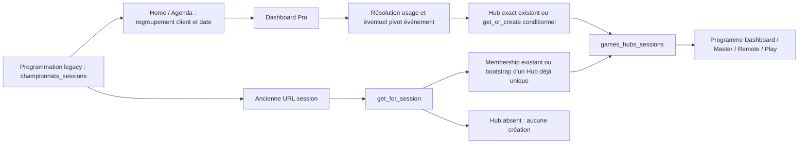

# Audit de compatibilité des programmations pré-Hub — 8 septembre 2026

## A. Verdict

**NON COMPATIBLE AVANT CORRECTIF**, au regard de l'exigence de migration intégrale, sans choix implicite, indépendante des offres et sûre quelle que soit la première surface ouverte le jour J.

Ce verdict porte sur les mécanismes du **code local audité**, pas sur un décompte d'incidents PROD. La présence et le nombre de données exposées restent à établir avec les requêtes jointes. Aucun accès DEV/PROD, SSH, DB distante ou navigateur ; aucun patch, migration exécutée, déploiement ou commit. Les neuf dépôts sont propres à la fin des lectures/tests. Les livrables sont exclusivement sous `/tmp/cotton-hub-audit/`. Le canon et HANDOFF sont volontairement inchangés conformément à la demande de ne rien modifier avant l'audit.

Les principaux contre-exemples prouvés :

1. **Hub absent : aucune création dans le resolver inverse session → Hub.** Dashboard Pro peut bootstrapper, mais une première ouverture de l'ancienne URL Master/Play ne garantit pas la racine Hub. Le SQL existant ne crée aucune racine à partir des sessions.
2. **Couverture partielle non réparée :** dès qu'un Hub possède un membership actif, `reconcile` retourne sans traiter ses autres sessions legacy. `sessions_get` ne réconcilie plus. Dashboard choisit en outre une racine exacte existante en lecture seule. Une interruption après le premier INSERT peut donc laisser un bootstrap définitivement partiel lors d'un nouvel appel.
3. **Choix implicites :** le resolver de contexte choisit le Hub de plus grand poids fonctionnel puis le plus petit ID ; son token non vide apporte déjà un poids positif. Ce choix précède même la priorité au contexte exact. Le resolver d'anciennes liaisons inactives fait un choix similaire.
4. **Le bootstrap PHP groupe par client/date sans filtrer l'opération.** Il peut rattacher plusieurs événements distincts à une racine unique, alors que le SQL livré a un autre prédicat.
5. **Des lectures Dashboard peuvent modifier les sessions :** le pivot événement attache/détache `id_operation_evenement`. La garantie « aucun paramètre historique modifié » n'est donc pas tenue par l'ensemble du chemin.
6. **Métadonnées métier :** lots divergents arbitrés par première session personnalisée ; initialisation possible avant que les memberships soient complets ; participations probables historiques masquées après bascule de leurs lecteurs vers la table Hub sans migration trouvée.
7. **Home filtre encore les offres positives anciennes.** Le cas `0/NULL` est bien inclus, mais cela ne couvre pas une programmation rattachée à une autre offre positive que l'offre courante.
8. **La migration PROD globale n'existe pas comme livraison complète vérifiée :** scripts dispersés, DDL runtime, objets Remote absents des migrations SQL autonomes trouvées, QR DEV explicitement hors périmètre PROD.

Une réconciliation paresseuse seule n'est **pas suffisante**. Il faut une préparation exhaustive du parc, un plan d'affectation explicite et un backfill administratif contrôlé avant la bascule, plus des corrections des chemins qui peuvent ensuite perdre l'accès ou altérer le contexte. Les lignes historiques ne doivent pas être recréées.

## B. Preuves documentaires et portée

Sources RAW téléchargées le 08/09/2026, branches comparées ; copies conservées dans les sous-dossiers `main/` et `develop/`. Les branches documentaires sont des intentions/historiques, **jamais une preuve du schéma déployé**.

| Source exacte | Section et conclusion documentaire |
|---|---|
| https://raw.githubusercontent.com/cotton-games/documentation-public/refs/heads/main/START.md | « Règle preuve d'abord », parcours et discipline de génération : entrée demandée. |
| https://raw.githubusercontent.com/cotton-games/documentation-public/refs/heads/develop/SITEMAP.txt | « Repos », « DB schema », « Project status » : navigation des ressources. |
| https://raw.githubusercontent.com/cotton-games/documentation-public/refs/heads/develop/DOCS_MANIFEST.md | « Update triggers », « Routing rules », R11/R12 : journal AI Studio avant patch ; QR manuelle DEV ; documentation de tout changement. |
| https://raw.githubusercontent.com/cotton-games/documentation-public/refs/heads/develop/canon/repos/global/README.md | « Update 2026-07-27 - Hubs: identité stable et rattachement canonique » : membership autoritaire, lectures non destructives, ajout explicite. C'est le contrat récent ; le passage plus ancien du même fichier sur réconciliation via `sessions_get` n'est plus exact dans le code. |
| https://raw.githubusercontent.com/cotton-games/documentation-public/refs/heads/develop/canon/repos/pro/README.md | « Etat 2026-07-17 - Dashboard soirée/événement: publication et lots Hub canoniques » : annonce le lazy-backfill à l'ouverture du programme ; contredit par les chemins actuels détaillés en C. |
| https://raw.githubusercontent.com/cotton-games/documentation-public/refs/heads/develop/canon/repos/pro/README.md | « Update 2026-09-01 - Préparation Hub sans offre active », « Update 2026-09-01 - Dashboard Hub: mode démo dans Actions » : préparation sans offre, mode découverte, Remote optionnelle pour l'offre inactive. |
| https://raw.githubusercontent.com/cotton-games/documentation-public/refs/heads/main/canon/repos/pro/README.md | « Etat 2026-06-04 - Preparation officielle Games sans offre active » : le contrat de préparation sans offre préexiste au Hub. |
| https://raw.githubusercontent.com/cotton-games/documentation-public/refs/heads/develop/canon/repos/games/README.md | « Update 2026-07-17 — Hub: publication et lots canoniques », « Update 2026-07-17 — Hub: publication et lots persistés » : import de la première session personnalisée seulement tant que `prizes_initialized_at` est vide. Ce comportement documenté ne respecte pas une exigence plus stricte refusant l'arbitrage implicite de lots divergents. |
| https://raw.githubusercontent.com/cotton-games/documentation-public/refs/heads/develop/games_hubs_sessions_phpmyadmin.sql | « Backfill borne » : une racine candidate existante ; aucune création de racine ; condition opération différente de PHP. |
| https://raw.githubusercontent.com/cotton-games/documentation-public/refs/heads/develop/games_hubs_phpmyadmin.sql | « hub soiree/evenement Lot 1 » : CREATE racines et memberships, pas de reprise de programmations. |
| https://raw.githubusercontent.com/cotton-games/documentation-public/refs/heads/develop/canon/runbooks/hub-player-qr-migration.md | « Statut et périmètre », « Import DEV confirmé par le résultat utilisateur », « Compatibilité et livraison ultérieure » : MariaDB 10.3.39 attestée en DEV, PROD en retard et migration globale distincte ; ne pas importer le script DEV en PROD. |
| https://raw.githubusercontent.com/cotton-games/documentation-public/refs/heads/main/canon/data/schema/DDL.sql | En-tête/version et définitions : aucun CREATE `games_hubs*` dans ce snapshot. Aucun état live PROD n'en découle. |
| https://raw.githubusercontent.com/cotton-games/documentation-public/refs/heads/develop/canon/data/schema/DDL.sql | Définitions `games_hubs`, publication, prizes, sessions, probables : snapshot partiel, pas tous les objets consommés par le code. |
| https://global.cotton-quiz.com/ai_studio/hub/api/public_reader.php?f=documentation%2Fgeneral%2F0_ROADMAP.md&token=C4BOQcmxkXAT0JfWajhb | Markdown décodé depuis `const raw` ; « TODO — CRITIQUE », « Fait, livré en PROD », entrées 21–28/08 et 25/03 : travaux externes décrits ci-dessous. |

Comparaison main/develop : les deux scripts `games_hubs*_phpmyadmin.sql` et le runbook QR renvoient 404 sur main ; les README main examinés ne décrivent pas les tables Hub du nouveau modèle. **Déploiement réel des objets Hub en PROD : non trouvé dans la documentation.** **Version actuelle PROD observée : non trouvé dans la documentation** ; 10.3.39 est la cible documentée/snapshot et la preuve DEV, à confirmer en PROD par `SELECT VERSION()`.

**Migration automatique exhaustive des participants probables, de tout branding et de toutes les métadonnées historiques : non trouvé dans la documentation consultée.** Une absence de mention n'est pas une preuve d'absence en DB ; les constats de C proviennent du code.

Éléments potentiellement divergents hors workspace d'après AI Studio : `global/app/modules/ecommerce/app_ecommerce_functions.php`, `pro/ec/modules/compte/authentification/ec_authentification_script.php`, `pro/ec/modules/compte/client_contacts/ec_client_contacts_script.php` (25/03) ; pages WWW, widget agenda, `.htaccess`, pages événements/sessions ; LP `www/lp/lp.php` et `lp/includes/*`, fichiers newsletters et lecteurs AI Studio (21–28/08). Le TODO signale le widget tarifaire et la fonction de tarifs de référence à coordonner. Pas de modification ciblée `app_games_hubs_functions.php` annoncée dans le journal lu ; **égalité avec les serveurs non certifiée**. Avant patch/déploiement, comparer les copies serveur transmises par l'opérateur, notamment ecommerce/auth/routing ; pas de rechargement SSH possible ici.

## C. Parcours réel du code

### C1. Modèle historique et invariants

Racine historique : [championnats_sessions, snapshot](/home/romain/Cotton/documentation/canon/data/schema/DDL.sql:436), 52 colonnes dans ce snapshot. `id` identifie la programmation, `id_securite` ses anciennes URLs, `id_client` son propriétaire, `date` sa date métier, `heure_debut/heure_fin` des textes persistés. `flag_session_demo=0` définit l'officielle, indépendamment de l'offre. `flag_configuration_complete=1` définit l'éligibilité des lecteurs Agenda/Hub et du backfill ; les incomplètes restent des lignes à conserver et à inventorier séparément. `online` est utilisé pour la publication, pas pour la sélection canonique du programme Hub.

`id_offre_client` référence l'offre historique et ne définit ni la propriété ni le contexte. Le snapshot est NOT NULL ; la présence réelle de NULL en PROD reste à vérifier, le code sait les inclure dans Home. `id_operation_evenement` rattache à `operations_evenements`; zéro ne permet pas à lui seul de distinguer une soirée d'une programmation événement non pivotée. `id_evenement` est un champ distinct présent dans le snapshot : rôle déterminant pour le rattachement Hub **non trouvé dans les fonctions de résolution auditées** ; exporter sa valeur, ne pas le substituer à `id_operation_evenement`.

La « journée » est principalement le regroupement client/date de Pro. Le contexte courant du compte est résolu par [ec_start_day_wording_get](/home/romain/Cotton/pro/web/ec/modules/tunnel/start/ec_start_sessions_day_helpers.php:808) : usage 2 → événement/gamification ; sinon typologies 1/4/5/6/8 → lieu public/soirée ; sinon fallback animation. Ce n'est pas un historique de la typologie lors de création.

Jeux : [app_jeu_get_detail](/home/romain/Cotton/global/web/app/modules/jeux/sessions/app_sessions_functions.php:4966) : type 1 Quiz historique (`quizs`, questions_lots), 5 Quiz configurable (`lot_ids`, métadonnées séries avec compat produit), 2 Bingo conservé pour archives, 3/6 Bingo playlist client (`jeux_bingo_musical_playlists_clients` et composition associée), 4 Blind Test playlist catalogue. `id_format` ne doit pas être confondu avec papier/numérique : le mode Hub est `flag_controle_numerique=0` → papier, sinon numérique ([mode_get](/home/romain/Cotton/global/web/app/modules/jeux/hubs/app_games_hubs_functions.php:5862)). La durée affichée peut être recalculée depuis le format/catalogue ; pas de colonne durée dédiée dans le snapshot session. Saison, finale, privé, weblive, jauge, position, textes/liens, lots et identifiants doivent rester inchangés.

### C2. Résolveurs et réconciliation

Toutes les fonctions ci-dessous résident dans [Global Hubs](/home/romain/Cotton/global/web/app/modules/jeux/hubs/app_games_hubs_functions.php), sauf mention. **Attention : leurs appels à `schema_ensure` peuvent faire du DDL ; ne pas les exécuter en PROD comme simples diagnostics.**

| Fonction / ligne | Entrée, critère et résultat | Écritures, limites et répétition |
|---|---|---|
| `find_for_context`, 2232 | client/date/type normalisé/opération max(0,id), exclut deleting ; lookup exact | Aucun write de données direct ; `LIMIT 1` acceptable seulement si UNIQUE exact réellement présent. Ne prouve pas unicité d'un contexte métier plus large. |
| `active_hubs_for_day_get`, 2287 | client/date, active=1, hors deleting ; tous les IDs | SELECT ; ne filtre ni type ni opération. |
| `canonical_existing_for_context`, 2318 | tous les Hubs actifs du jour ; poids label +8, token +1, présentation +2, liens +4, joueurs +8, lots/publication +4 chacun | Tri poids décroissant puis ID croissant ; premier poids positif prioritaire sur l'exact. Avec tokens normaux, plusieurs candidats peuvent être implicitement arbitrés. |
| `get_or_create_for_context`, 2403 | client/date valides ; contexte normalisé `day/soiree/event`, opération non négative ; label fourni ou NULL | Unique SQL `(id_client,hub_date,context_type,id_operation_evenement)` et token unique. Hub puis reconcile, puis initialisation stats. Reconcile du trouvé seulement si statut `exact` ; ce statut peut être éclipsé par le poids. Nouveau → source `get_or_create_created`, collision → `get_or_create_race`, exact → `get_or_create_found`. Aucun guard offre. |
| `inactive_context_release_if_empty`, 2359 | racine inactive non deleting, sans membership actif/joueur actif/lot | DELETE publication, memberships et racine, puis retry création. La publication seule n'empêche plus la suppression ; liens historiques inactifs supprimés aussi. Sinon `inactive_context_conflict`. Pas une migration universellement non destructive. |
| `sessions_legacy_sql_where`, 2638 | client/date exacts, demo=0, configuration=1 | **Aucun filtre opération/type/offre/online/futur.** |
| `sessions_reconcile`, 2654 | Hub actif valide ; si AU MOINS un membership actif, early-return `persisted_memberships_authoritative` | Sinon exige l'unique Hub actif du jour. Parcourt toutes les officielles complètes du jour ; refuse lien actif étranger, refuse historique seulement étranger ; INSERT/UPSERT actif sur paire. Ne crée jamais Hub ni session. Échec requête initiale → ok=false ; échec INSERT individuel non remonté comme échec global. |
| `session_membership_ensure`, 2764 | Hub explicitement désigné, actif hors deleting ; session existante officielle complète ; client/date/opération strictement égaux | Refuse autre membership actif ; réactive/crée paire, relit cible. Idempotent même paire. Source défaut `explicit_hub_add`. Ne répare pas contexte divergent. Pas de contrainte unique « un actif par session ». Relecture finale confirme cible mais ne garantit pas absence d'un concurrent ajouté entre temps. |
| `session_legacy_candidate_hub_ids`, 2884 | client/date/active + opération strictement égale (zéro sinon), sans filtre deleting | Helper **différent** du bootstrap du jour actuel. Ne pas l'utiliser comme description du chemin effectivement appelé par `get_for_session`. |
| `sessions_get`, 2914 | memberships actifs + même client session/Hub + officielle complète ; ordre date/heure/position/ID | Ne crée aucun lien. Date et opération divergentes ne retirent pas une session ; divergence client, démo ou configuration incomplète la retirent. Pas de filtre offre. |
| `get_for_session`, 4859 | membership actif joint à un Hub : unique retourné, même racine inactive ; >1 → ambigu | Client/date divergents journalisés mais racine retournée ; opération pas corrigée. Sans actif, anciens liens inactifs vers Hubs actifs pondérés, Hub retourné sans réactiver membership. Sinon unique Hub du jour → reconcile ; zéro → vide ; >1 → vide. Aucune création de racine. |
| `membership_get_for_session_id`, 5036 | lookup canonique minimal, option de fallback legacy | Plusieurs actifs refusés ; fallback appelle resolver legacy ; distinct de la commande explicite de rattachement. |
| `get_for_event`, 5179 | opération positive, Hubs actifs toutes dates confondues | Exactement un → renvoyé, plusieurs → vide/log. Aucun CREATE ; événement multi-jours peut être ambigu ici alors que chaque jour est valide. |
| `app_evenement_pivot_ensure_for_day` | [Global événements, 471](/home/romain/Cotton/global/web/app/modules/operations/evenements/app_evenements_functions.php:471), client usage=2/date/IDs | >1 opération → ambigu ; contrôle propriétaire/jour ; crée un événement via slug client/date, attache les sessions sans opération. Un pivot géré d'un autre jour peut être détaché puis recréé/rattaché. Fonctions attach/detach lignes 288/311 mettent à jour `championnats_sessions`. Pas de transaction couvrant tout. |

**Atomicité/concurrence :** tables déclarées MyISAM, suite de SELECT/INSERT/UPDATE distincts. L'unique contexte protège deux INSERT pour la même clé exacte, pas deux clés différentes du même jour. L'unique paire protège le doublon d'une même liaison, pas deux Hubs actifs pour une session. Deux ouvertures avec des contextes différents ou des données apparues entre SELECT et INSERT ne sont pas sécurisées par une transaction globale. Un incident après le premier membership suffit à rendre le prochain `reconcile` inopérant sur le reste. `linked` compte les requêtes réussies, pas une preuve de totalité des liens attendus.

### C3. Première ouverture, dont jour J

| Surface | Sans Hub | Hub présent, membership manquant |
|---|---|---|
| Home, `communication/home/ec_home_index.php:104` et résumé `day_helpers.php:1134` | Lit sessions, lien vers journée ; ne crée pas directement | Pas de garantie de réparation ; filtrage offre positif ci-dessous. Des enrichissements indirects peuvent consulter le resolver, sans création de racine. |
| Agenda, `ec_start_sessions_list.php:1200` | Lit officielles complètes du compte, sans filtre offre ; lien date | Groupement jour et projections ; pas de backfill exhaustif. |
| Dashboard `/extranet/start/games/day/{date}` et `/dashboard`, `ec_start_sessions_day.php:55–224` | Oui **conditionnellement** : sessions complètes présentes, client non siège, aucun membership actif trouvé dans le lot. Contexte `event` si opération unique/pivot ; `soiree` si lieu public ; sinon `day`. Label par défaut courant, pas import général du nom historique. | Hub exact actif → `found_read_only`, pas reconcile. Si programme Hub non vide, remplace la liste historique par ce sous-ensemble ; si vide, garde la liste historique mais fournit des URLs vers un Hub vide. Membership actif quelconque du jour interdit aussi bootstrap d'un autre contexte. |
| Personnalisation jour, `ec_start_sessions_day_personalization_helpers.php:41` | Appelle get_or_create ; ne constitue pas une garantie pour les autres entrées | Soumise aux mêmes choix/early-return ; pas une migration préalable. |
| Fiche session Pro, `ec_start_sessions_view.php:1–110` | Détail legacy, retour journée ; pas de création directe Hub | Les compteurs de probables peuvent appeler get_for_session et donc le bootstrap borné, mais pas corriger un Hub déjà partiellement lié. |
| Master Hub, `app_hub_master_ajax.php` → `app_hub_view_helpers.php:243` | Token Hub exigé : inexistant → introuvable | Lit uniquement programme persistant ; pas de réparation. |
| Remote Hub, `app_hub_remote_ajax.php` | Token d'accès Remote valide et Hub préexistant requis | Commandes sur programme/présence ; aucune création de racine legacy. |
| Games Play Hub, `app_hub_play_ajax.php` et contexte commun | Token Hub existant | Lecture des memberships ; pas de bootstrap global. |
| Ancien Master `/master/{sessionToken}`, `app_orga_ajax.php:145` | get_for_session ne crée pas Hub ; chemin session subsiste, intégration Hub non garantie | Bootstrap seulement si unique Hub du jour sans aucun lien actif ; sinon mêmes trous. |
| Ancien Remote `/remote/{jeu}/{sessionToken}`, `remote_canvas.php:75–161` | Ancien contexte session ; pas création Hub ; garde commerciale à l'entrée | Le contexte Remote Hub suppose un token et une appartenance déjà valide ; garde ancienne peut bloquer avant préparation Remote. |
| Ancien Play `/play/{jeu}/{sessionToken}`, `player_canvas.php:188` | Resolver inverse, aucune racine créée | Liaison possible seulement dans le cas legacy borné ; redirections/reprise dépendent ensuite du runtime. |
| Ancien Pro `/extranet/games` | 301 vers Agenda (`pro/web/.htaccess:255–256`) | Pas de reprise supplémentaire. L'ancien accès direct `ec.php?t=jeux&m=sessions&p=list` conserve un aiguillage INS vers onboarding (`ec.php:275`) : autre surface à recetter. |
| Ancien Pro `/extranet/start/game/play/{token}` | `ec_start_sessions_play_classic.php:14` garde offre puis interface historique | Pas de bootstrap obligatoire ; sans offre redirection commande à l'entrée. |
| WWW ancienne session/événement, EP Hub | `fo_sessions_seo.php:37`, `fo_evenements_seo.php:24`, `play/.../ep_hubs_detail.php:10` : resolvers session/événement/token existant | Aucun CREATE racine garanti ; événement multi-Hub renvoie ambigu. |

**Jour J sans ouverture préalable : non sûr pour toutes les entrées.** Le cas simple peut marcher si l'organisateur ouvre Dashboard d'abord, que tout est complet, que les données sont non ambiguës et que les INSERT réussissent tous. Cela ne prouve pas la sécurité d'un ancien lien Master, Remote, Play ou public ouvert directement. Il n'y a pas de batch de création des racines retrouvé dans les scripts de migration Hub inventoriés.

### C4. Contenu et changements de portée

| Donnée | Conservation physique du backfill Hub isolé | Risque d'usage / bootstrap actuel |
|---|---|---|
| Type jeu, produit, séries `lot_ids`, playlist | Pas de UPDATE session dans reconcile | Les tables catalogue/playlist et compositions doivent aussi être conservées. ID conservé n'est pas preuve de contenu identique. Type 2 Bingo est décrit comme archives : session future à examiner. |
| Papier/numérique, format, dates/heures | Pas de reset direct dans reconcile | Dashboard événement peut changer opération ; durée affichée dépend du catalogue. Ancienne date peut être supplantée par temporalité Hub si membership divergent. |
| Lots session `lot_1..3` | Restent stockés | `prizes_resolve_from_sessions:3474`, bootstrap:3624, get:3672 : première session personnalisée, ordre du programme ; conversion d'ordre Bingo ; divergences seulement loguées. Si programme vide/aucun lot custom, marque déjà initialized. Future réconciliation ne réimporte plus les lots. Concurrence/échec INSERT non atomiques. |
| Branding | Pas de copie globale legacy → Hub trouvée | `branding_get:5285` : session optionnelle, Hub type 5, réseau/compte, defaults Cotton ; passe opération=0 au merged. Sur Master Hub l'ID session est 0. Une personnalisation historique uniquement session/événement peut donc ne pas devenir celle de la soirée. Pas de fusion implicite sûre de plusieurs brandings. |
| Publication | Sessions et opération ne sont pas supprimées par reconcile | `publication_get:3122` ne bootstrappe pas. Résolution publique:3310 : titre et lieu peuvent retomber sur événement/compte ; statut Hub vide considéré activé ; les filtres sessions publiques utilisent online/privé, mais ne prouvent pas à eux seuls conservation de toutes les règles de l'ancienne page. Risque de fallback texte, URL et visibilité à recetter, pas affirmer publication privée exposée sans preuve runtime. |
| Label/contexte | Label Hub créé depuis argument du caller | Dashboard utilise un défaut ; rendu titre peut récupérer événement historique ; pas de bootstrap général du `nom` session vers hub_label. Typologie actuelle ne prouve pas typologie initiale. |
| Participants probables | Lignes historiques conservées | `app_sessions_functions.php:5349,5470,5489` : dès qu'un Hub est résolu, count/list retournent les déclarés Hub ; aucune union/import legacy ici. Un compteur peut tomber à zéro malgré anciennes lignes. Cas équipes sans identité EP exige une stratégie explicite. |
| Jauge et préparation | Reconcile ne les touche pas | Hors backfill, `app_sessions_attach_future_unlinked_to_offer:3895` peut réaffecter offre et jauge lors activation ; ce n'est pas une réparation structurelle à utiliser. Démo Hub isolée crée un runtime de test : ne pas confondre avec recréation de programmation officielle. |
| Joueurs/runtime/résultats | Tables historiques restent nécessaires | `games_hubs_players_sessions` est un mapping spécifique, pas reconstructible par pseudo seul. Stats auto get_or_create sont projections depuis memberships/mappings prouvés ; ne garantissent pas import de tous joueurs legacy. Aucun lancement runtime requis pour migration. |

## D. Matrice des cas historiques et anomalies

Dans cette matrice « conservée » signifie ligne historique encore présente, pas parcours intégral certifié.

| Avant | Mécanisme actuel → après | Risque / décision |
|---|---|---|
| Soirée complète, Hub absent | Dashboard → CREATE soiree → bootstrap jour | Possible cas simple ; pas garanti via ancienne URL ; plan préalable nécessaire. |
| Événement complet avec opération valide, Hub absent | Pivot vérifié → CREATE event → liens | Possible si opération unique/jour ; contrôler période/propriétaire ; pas d'opération inventée. |
| Gamification sans opération | Pivot crée/attache opération → Hub event | **Modifie historique** ; interdit dans migration exigée tant qu'exception non décidée. |
| Hub exact actif, zéro membership | Dashboard le lit sans reconcile ; ancien resolver peut bootstrapper | Résultat dépend de surface ; backfill explicite requis. |
| Hub déjà lié + autre session legacy orpheline | early-return → orpheline persistante | **Bloquant**, même avec unique Hub. Réparation sûre uniquement si affectation prouvée, sans modification session. |
| Hub/membership conformes | lecteurs conservent relation | Cas compatible structurellement ; vérifier paramètres et accès. |
| Plusieurs sessions même Hub | bootstrap initial les parcourt toutes | Répétition après succès OK ; arrêt partiel non repris. |
| Plusieurs Hubs actifs client/date | reconcile refuse ; get_or_create peut pondérer | **Ambigu**, aucun auto-choix acceptable. Plan opérateur explicite. |
| Deux soirées distinctes sans opération même date | même clé soiree/0 ; aucune identité soirée distincte dans cette clé | **Impossible à distinguer automatiquement** ; preuve métier supplémentaire nécessaire. |
| Plusieurs opérations même date, zéro Hub | pivot refuse puis Dashboard peut rester `day/0`; bootstrap jour ignore opération | Risque de regroupement indu ; ne pas créer un Hub générique pour « résoudre ». |
| Hub unique opération différente de session | PHP peut rattacher malgré divergence ; ensure explicite refuse | SQL/PHP divergents ; réparation uniquement après validation contexte. |
| Événement sur plusieurs jours | plusieurs clés date valides ; get_for_event voit plusieurs Hubs | Ancienne page événement ambiguë ; traiter identité/page globale explicitement. |
| Racine inactive vide | get_or_create peut supprimer racine/publication/liens inactifs et recréer | Ne pas employer comme migration non destructive. Inventorier métadonnées restantes. |
| Racine inactive avec actifs/joueurs/lots | conflit, pas réactivation automatique | Correction manuelle/plan dédié après preuve d'intention de suppression. |
| Membership actif vers Hub inactif/deleting | resolver peut renvoyer racine, UI token refuse | Lien présent ≠ accès structurel opérationnel ; quarantaine. |
| Membership orphelin sans Hub | JOIN resolver masque l'orphelin ; précheck brut peut bloquer bootstrap | Compter liens bruts ET joints ; pas de supposition d'absence de liaison. |
| Plusieurs memberships actifs | resolver inverse refuse ; chaque Hub peut afficher sa propre liaison | Pas de réparation automatique arbitraire ; unique paire insuffisant. |
| Membership divergent date/opération | autorité conservée par lectures | Ne pas déplacer pour « normaliser » ; vérifier intention avant de valider plan. |
| Membership divergent client | resolver retourne avec log ; programme filtre par client | Invisible/incohérent ; correction nécessite preuve propriétaire, jamais import intercompte automatique. |
| Seulement membership inactif | resolver peut choisir un ancien Hub sans réactiver lien | Hub trouvé mais programme absent ; multiple historique peut être pondéré. |
| Session sans date/zero date/client absent | hors bootstrap valide / hors futur ordinaire | Conserver et relever à part ; date/client ne peuvent être inventés. |
| Session partiellement configurée | hors Agenda/Hub/bootstrap | Reste en DB mais pas affichée ; conservation du brouillon et chemin de préparation à définir. |
| Démo mêlée aux officielles | demo=1 exclue du bootstrap | Bonne séparation si flags fiables ; NULL/autres valeurs en anomalies. Ne pas convertir démo en officielle. |
| J−1 encore actif runtime | fenêtre jusqu'à J+1 midi Europe/Paris | Filtre date>=aujourd'hui insuffisant ; cohorte complémentaire fixe J−1 avant midi et runtimes ouverts à inventorier. |
| Offre active / expirée / absente / 0 / NULL | primitives Hub sans condition d'offre | Structure doit traiter toutes ; Home et anciennes entrées restent à corriger/recetter. |
| Papier / numérique, Quiz / BT / Bingo | même structure session | Contrat contenu et launcher spécifiques, pas de conversion de format dans backfill. Type inconnu/archivé à bloquer pour décision. |
| Ancien Agenda / tunnel / first-party | pas de marqueur Hub requis à la création historique | Ne pas filtrer par origine commerciale, pipeline ou offre ; reprendre l'ID existant. |
| Lots/branding/publication/probables non vides | lecture Hub change d'autorité ou de fallback | **Important à bloquant** selon données ; conserver originaux et importer uniquement mapping validé. |
| Nouvelle exécution du backfill | UPSERT paire ; SQL INSERT IGNORE | Répétition sans doublon paire seulement ; pas garantie reprise après incident ni de totalité. |

Détection : `01` inventorie même les incompletes et les flags atypiques ; `02` compte candidats, actifs bruts, orphelins, divergences et couverture partielle ; `03` compare cohorte figée et empreintes. Dates/périodes événements, contenu des produits et intention des anciens liens doivent être confrontés aux exports, pas déduits du plus petit ID.

## E. Guards d'offre : préparation / structure / lancement

| Garde / fonction | Surface et moment | Dépendance et effet |
|---|---|---|
| `app_ecommerce_offre_effective_get_context`, Global ecommerce:13798 | Résolution commerciale courante, réutilisée par Pro/Games | Priorité offre propre active (état 3, délégation compatible, exclusion catalogue support), puis contrat/activation/délégation réseau. Ne se résume ni à l'offre de la session ni à COUNT(état=3). Le SQL fourni rapporte ces états bruts sans prétendre calculer exactement le resolver réseau avant réception du schéma. |
| Home `ec_home_next_sessions_day_summary_get`, Pro day_helpers:1134–1199 | Avant sélection prochaine date et cartes | Quand offre courante positive : future `id_offre_client=courante OR 0 OR NULL`. Une autre offre positive est exclue, même avec programmation future. Sans filtre fourni : toutes les offres. Bloque visibilité Home de certains historiques, pas leur existence. |
| Agenda `ec_start_sessions_list.php:1200–1228` | Sélection sessions | Aucun filtre offre ; client + officielle + complète. Pipeline intervient dans création/navigation, pas dans ce WHERE. Réseau a une vue spécifique. |
| Dashboard `ec_start_sessions_day.php:55–224` | Lecture/création conditionnelle Hub | Aucun guard offre avant création/reconcile ; client siège exclu du Dashboard date, indépendamment de l'offre. Plusieurs statuts structurels peuvent néanmoins empêcher le Hub. |
| `app_games_hub_get_or_create_for_context`, reconcile, ensure | Migration structurelle | **Aucune dépendance à `id_offre_client` ou offre effective.** Les blocages structurels ne doivent pas être contournés en activant une offre. |
| Dashboard `dashboard_view.php:112`, `day_helpers.php:1562`, script `dashboard_master_access_check` autour de 2754 | Affichage mode démo et accès Master/Remote | Offre inactive → découverte ; Remote `required` → `optional`. Présence/appareil/fenêtre peuvent limiter lancement, pas suppression programmation. |
| Nouvelle préparation, `ec_start_script.php:3000`, service Global quick Hub | Ajout/configuration pour un Hub explicite | Peut conserver officielle avec offre=0 ; ne remédie pas aux sessions historiques manquantes. Anciennes branches session_theme traitent aussi activation/offre : ne pas les utiliser comme migration. |
| `app_session_launch_guard_get`, sessions:3794 | Fiche, listes, classique, Canvas, runtime | Démos autorisées ; officielle : offre effective actuelle du compte. Aucune obligation que l'offre historique session soit active. Raisons inactive/network... et CTA commercial. |
| `app_games_hub_launch_runtime_decision`, Hubs:9689 | Décision lancer depuis Hub | Avant jour → démo ; fenêtre ouverte + accès propre/réseau → officielle ; sans accès → démo ; expiré → refus. Une exécution déjà ouverte conserve son mode et autorise reprise ; contrôler ce cas distinctement si offre expirée en cours. |
| `app_games_hub_session_launch_from_master`, Hubs:9951 et 10073 | Exécution effective | Garde commerciale officielle de nouveau contrôlée sauf runtime réutilisable ; vérification membership, temporalité, runtime ; numérique/papier ont ensuite leur bootstrap propre. |
| `organizer_canvas.php:428`, `games_ajax.php:268` | Ancien Master et API actions runtime | Master prépare avec projection du guard ; API refuse mutations runtime officielles hors fenêtre/sans accès. Ne garantit pas racine Hub pour session legacy. |
| `remote_canvas.php:145–161` | **Entrée ancienne Remote session** | Sans offre et hors démo, message de blocage de l'interface Remote (« utiliser la remote et lancer… »). Plus tôt que lancement ; différence avec Remote Hub découverte. |
| `ec_start_sessions_play_classic.php:14` | **Entrée ancienne page jouer Pro** | Sans offre : redirection commande avant rendu ; préparation papier historique à recetter par fiche/Hub. |
| `ec_start_day_session_individual_access_get`, helpers:1991 | CTA individuel mobile | Guard lancement + contenu configuré + types 4/5/6 + fenêtre ; pas garde de migration, mais ne rend pas tous anciens types équivalents. |
| QR joueur `app_games_hub_player_qr_functions.php:106` | Autorisation d'exécution officielle liée au QR | Réutilise garde lancement ; ne doit pas devenir un prérequis à l'import structurel. |

Le contrat demandé est largement présent dans les primitives structurelles, **mais pas garanti bout en bout sur toutes les anciennes surfaces**. L'offre absente ne justifie jamais d'exclure une ligne des préchecks ou du plan. Les comptes réseau/siege demandent une recette propre, pas une assimilation automatique à « sans offre ».

## F. Risques PROD, schéma et tests

### F1. Classement

**BLOQUANT PROD** : absence de création de racines préalable pour toutes les sessions ; dépendance à la première surface ; early-return sur couverture partielle ; arbitrage de racines par poids/ID ; bootstrap date ignorant opération ; mutations session par pivot ; reprise non démontrée des métadonnées métier selon parc ; schéma PROD réel et migration globale non établis ; absence de preuve PRE/POST par IDs et paramètres.

**IMPORTANT** : Home ancienne offre masquée ; ancien Remote/classique bloqués dès entrée ; relation inactive retournée comme Hub sans liaison active ; racine inactive orpheline ; période J+1 midi versus sélection calendaire ; événements multi-jours/publication ; catalogue/playlist/brandings sources non contrôlés ; ancien type 2 / brouillons ; DDL runtime et coût N+1 de réconciliation.

**Tolérable après contrôle** : différence d'un libellé purement générique explicitement acceptée ; projection stats rebuildable seulement si sources historiques conservées ; ordre de présentation de sessions dans un Hub **déjà affecté explicitement**. Aucune perte de contenu ni résolution d'ambiguïté n'est classée tolérable.

### F2. Inventaire complet des objets Hub attendus dans le helper

[Schéma attendu détaillé](schema-attendu.md) reproduit les **11 tables** déclarées par `app_games_hub_schema_ensure`, avec colonnes, états et indices. Le détail est une annexe de preuve, pas un SQL à importer. Déclarations : Global `app_games_hubs_functions.php:176–539` ; QR dans helper séparé `app_games_hub_player_qr_functions.php:11–37` ; stats dans migration manuelle.

Dans le tableau, **M0** signifie : présence en PROD **non trouvée dans la documentation main examinée**, aucun CREATE de cet objet dans le snapshot main ; il faut 00. **D-code** signifie attendu par code local et décrit par les sections Hub des README develop cités, sans preuve d'application PROD. **D-snapshot** signifie également présent dans DDL develop.

| Objet / évolution | main / develop | SQL disponible / idempotence | Backfill, ordre, impact |
|---|---|---|---|
| `games_hubs` racine : id/token/client/date/type/opération/label/active/status/timestamps ; uniques token et contexte, indices client/date/opération | M0 / D-snapshot | `documentation/games_hubs_phpmyadmin.sql`, CREATE IF NOT EXISTS | Aucun import de programmations ; ne réaligne pas table existante. Racine avant dépendances. |
| `games_hubs_sessions` : paire, source, status active/inactive, created/updated ; unique paire, indices Hub/status et session | M0 / D-snapshot | même script + `games_hubs_sessions_phpmyadmin.sql` | Second script contient INSERT IGNORE legacy ; **ne pas l'importer comme simple DDL** ; critères en F3. |
| `games_hubs_players` : identités, pseudo, auth guest/ep, état active/left, retour, timestamps, IP/hash ; uniques Hub/auth, indices Hub/status/pseudo/retour | M0 / D-code | Games `2026-07-08_games_hubs_players.sql`, IF NOT EXISTS | Pas d'import de joueurs legacy ; racine d'abord. |
| `games_hubs_players_sessions` : Hub/joueur/session, tokens, type, participation, participant_key, état, erreurs, timestamps ; unique joueur/session, indices Hub/session, session, game/participant | M0 / D-code | `2026-07-08_games_hubs_players_sessions.sql`, IF NOT EXISTS | Pas de backfill de joueurs ; joueurs et sessions d'abord. |
| Mappings : `auto_joined_at`, `manual_joined_at`, `last_joined_at`, `left_at`, `completed_at`, `join_count`, `last_action`, enum étendu | M0 / D-code | `2026-07-09_games_hubs_players_sessions_access_state.sql` : ALTER non gardés | Pas de backfill métier ; defaults seulement. Non rejouable tel quel pour colonnes existantes. |
| Focus : `active_session_id`, `active_session_activated_at`, index active_session | M0 / D-snapshot | `2026-07-09_games_hubs_active_session_focus.sql` : ALTER ADD non gardés | Table racine d'abord ; colonnes déjà dans CREATE racine actuel → doublons si scripts concaténés aveuglément. |
| `games_hubs_publication` : title/tagline/description/lieu/adresse/cp/ville/pays/site/CTA/publication_status/timestamps ; unique Hub | M0 / D-snapshot | `2026-07-17_games_hubs_publication_prizes.sql`, IF NOT EXISTS | Pas de copie publication historique ; racine avant. |
| `games_hubs_prizes` : rang,label,description,timestamps ; unique Hub/rang | M0 / D-snapshot | même SQL, IF NOT EXISTS | Pas de backfill SQL métier ; bootstrap applicatif à première lecture. |
| `prizes_initialized_at` | M0 / D-snapshot | `2026-07-17_games_hubs_prizes_initialization_state.sql`, test information_schema + ALTER conditionnel | Rejouable si compatible ; pas d'import lots, pas de preuve de conformité complète d'une colonne préexistante. |
| Stats joueurs : `stats_aggregate_score`, `stats_wins_count`, `stats_second_places_count`, `stats_third_places_count`, `stats_parties_count`, `stats_last_result_at`, `stats_source_revision`, `stats_computed_at`, `stats_dirty_at`, `stats_error` | M0 / D-code | `2026-07-30_games_hubs_players_stats_projection.sql` : métadonnées et ALTER conditionnels | Initialisation defaults, aucun recalcul scores legacy par ce SQL ; rebuild distinct depuis liens/mappings prouvés. |
| Photos joueurs : `hub_photo_media_id`, `hub_photo_game_key`, `hub_photo_source`, `hub_photo_updated_at` | M0 / D-code | `2026-07-31_games_hubs_players_active_podium_photo.sql` : ALTER conditionnels | Aucun import des photos anciennes ; joueurs d'abord. |
| `games_hubs_participations_probables` : Hub/client/opération/token, identité/EP, source, états declared/cancelled/confirmed, dates audit/déclaration/annulation/confirmation, IP/users ; unique Hub/identité | M0 / D-snapshot | `2026-07-31_games_hubs_participations_probables.sql`, IF NOT EXISTS | Aucun transfert de `championnats_sessions_participations_probables`. |
| Remote accès : `games_hubs_remote_access`, tokens/hash, états active/revoked, label, dates, session hash | M0 / D-code | CREATE embarqué Global:453 ; **SQL autonome non trouvé** dans migrations inventoriées | Unique hash token, indices Hub/status et session hash ; aucune génération obligatoire de tokens pendant reprise legacy. |
| Remote présence Master : `games_hubs_remote_master_presence`, instance, révisions, visibilité, dates | M0 / D-code | CREATE embarqué:476 ; SQL autonome non trouvé | Unique Hub/instance, index Hub/seen. |
| Remote présence runtime : `games_hubs_remote_runtime_presence`, session/exécution/instance/visibilité/dates | M0 / D-code | CREATE embarqué:495 ; SQL autonome non trouvé | Unique Hub/session/exécution/instance, index présence. |
| Remote commandes : `games_hubs_remote_commands`, accès/type/payload, pending/claimed/processing/completed/failed/expired/cancelled, clé idempotente, claim/résultat/erreurs/dates | M0 / D-code | CREATE embarqué:514 ; SQL autonome non trouvé | Unique Hub/command_key ; indices pending et accès/date. Aucun replay de commandes historiques à déclencher en migration. |
| Routing racine : `remote_routing_generation`, `remote_routing_intent_id`, `remote_transition_type`, `remote_transition_payload_json`, `remote_transition_started_at` | M0 / D-code | CREATE/ALTER conditionnels embarqués:198–202,233–237 ; SQL autonome non trouvé | Pas de reconstruction automatique d'une transition en vol à partir d'une session ; conserver états existants. |
| Présentation : `presentation_session_id`, `presentation_mode`, `presentation_updated_at` | M0 / D-code (snapshot incomplet) | `2026-08-25_games_hubs_presentation_session.sql` seulement ID/index (non gardé) ; mode/dates dans ensure | SQL de présentation seul ne suffit pas ; index pas automatiquement ajouté par branche ALTER du ensure. |
| Exclusivité instances : `hub_master_instance_id/seen_at`, `hub_remote_instance_id/seen_at` | M0 / D-code | ensure, SQL autonome non trouvé | Defaults et dates sans backfill. |
| Suppression reprenable : `delete_operation_token`, `delete_step`, `delete_started_at`, `delete_error_at` | M0 / D-code | ensure, SQL autonome non trouvé | Ne pas effacer une intention deleting en déploiement. |
| QR joueurs : `player_qr_display_mode`, `player_qr_display_revision`, `player_qr_display_confirmation_json`, `player_qr_official_started_at` | main runbook absent / DEV confirmé develop | `documentation/migrations/hub_player_qr_dev.sql` ; idempotent et définitions contrôlées ; **DEV uniquement** | Pas de données/backfill, defaults ; helper QR lecteur ne crée pas colonnes. PROD nécessite migration globale propre. |

Tous les chemins Games SQL ci-dessus sont sous `/home/romain/Cotton/games/web/includes/canvas/sql/`. Les fichiers conditionnels vérifient au moins l'existence, mais **existence n'est pas conformité de type/index/défaut**. Comparer au relevé réel avant de construire le DDL consolidé.

**Prérequis transversaux à vérifier aussi :** `championnats_sessions` et champs récents `lot_ids`/lots ; catalogue et compositions ; `operations_evenements` et colonnes du pivot/SEO ; `general_branding` et scope Hub type 5 ; `game_events` (SQL Games `game_events.sql`, journal d'exécutions Hub dans payload, pas une table `hub_executions` à inventer) ; tables runtime Quiz/BT/Bingo ; participations historiques/connectées ; contrat/offres/activation réseau et identités EP. Leur existence ou leur indexation ne se déduit pas des scripts Hub. Le bloc 00 demande aussi ces métadonnées. Les scripts documentation `championnats_sessions_participations_*_phpmyadmin.sql` portent des migrations antérieures séparées : ne pas les réimporter sans comparer le schéma et leur DML.

**Locks :** les CREATE sur objets absents évitent copie de table existante mais requièrent verrous métadonnées ; ALTER MyISAM potentiellement copie/locks, defaults matérialisés, durée inconnue ; INSERT legacy implique lectures/jointures et écritures MyISAM, pas transaction globale. Runtime `schema_ensure` exécute même un `ALTER ... MODIFY status` de mappings sans test de différence (ligne 396), une fois par requête PHP. Son flag statique est activé avant validation globale des DDL et les erreurs ne constituent pas une migration atomique. Il ne faut pas déléguer le déploiement de schéma au premier client du jour J. Aucun temps de lock PROD n'est déduit du faible volume DEV.

### F3. Audit précis du SQL legacy disponible

[games_hubs_sessions_phpmyadmin.sql](/home/romain/Cotton/documentation/games_hubs_sessions_phpmyadmin.sql:22) :

- part des sessions officielles complètes **toutes dates**, pas uniquement futures ;
- exige Hub existant même client/date, actif et `(Hub.opération=0 OR Hub.opération=session.opération)` ;
- exige exactement un candidat selon CE prédicat, qui n'exclut pas `hub_status='deleting'` ;
- refuse autre membership actif ; `INSERT IGNORE` avec source `legacy_reconciled` ;
- si même paire existe inactive, `IGNORE` n'active pas cette ligne ; si ancien lien inactif vers autre Hub, il n'est pas exclu par le SQL alors que PHP peut le bloquer ;
- ne crée aucune racine ; ne modifie pas les sessions ; ne copie ni lots, ni branding, ni probables ;
- unique paire prévient doublon paire, pas tout concurrent inter-Hub ; `IGNORE` peut masquer davantage qu'un simple doublon selon le schéma ; contrôler avertissements et résultats ;
- rollback commenté par source `legacy_reconciled` seul est **trop large** : il pourrait désactiver des liens antérieurs au lot. Revenir seulement sur IDs précisément créés par une migration identifiée.

**Ce script n'est pas équivalent à PHP et n'est pas approuvé pour PROD en l'état.**

### F4. Tests existants vérifiés

Neuf suites PHP ont été exécutées, sorties code 0 :

| Dépôt | Commande depuis la racine | Nature / preuve réelle |
|---|---|---|
| global | `php web/tests/hub_identity_stability_contract_test.php` | Fake DB + assertions de source ; stabilité identité, lecture sans reconcile, bootstrap unique, ensure explicite/idempotent/conflit. Test existant accepte la racine pondérée et le lien inactif retourné. |
| global | `php web/tests/hub_prizes_test.php` | 8 assertions pures : rangs, défauts, première personnalisation et conflit. |
| global | `php web/tests/hub_publication_prizes_contract_test.php` | Contrats statiques publication/initialisation ; pas conservation d'un export PROD. |
| global | `php web/tests/hub_operation_branding_cascade_test.php` | Cascade branding et contrats ; pas migration exhaustive branding ancien. |
| global | `php web/tests/hub_demo_mode_contract_test.php` | Décision offre active/réseau/inactive + fenêtres, avec offre simulée. |
| global | `php web/tests/hub_probable_participations_contract_test.php` | Bascule des helpers vers Hub ; pas import des déclarations anciennes. |
| pro | `php web/ec/modules/tunnel/start/ec_start_sessions_list_agenda_test.php` | Contrat Agenda. |
| pro | `php web/ec/modules/tunnel/start/ec_start_sessions_day_dashboard_test.php` | Contrat Dashboard, préparation sans offre, CTA/contexte. |
| pro | `php web/ec/modules/tunnel/start/ec_start_hub_demo_dashboard_test.php` | Présentation offre inactive/découverte. |

Message environnement commun « Failed to connect to bus: No data available », sans échec d'assertion. Aucun diagnostic DEV connecté exécuté (`hub_session_membership_dev_diagnostic.php` seulement repéré). Aucun nouveau test ajouté aux dépôts.

Autres tests repérés : `hub_paper_cold_runtime_bootstrap_contract_test.php`, `hub_participation_counters_contract_test.php`, projections stats, QR, tests temporels ; leur existence ne vaut pas preuve du scénario de reprise pré-Hub.

Matrice minimale demandée : (1) soirée sans Hub et (2) événement sans Hub **pas démontrés de bout en bout** ; (3) Hub sans lien **partiel**, manque entrée Dashboard et interruption ; (4) déjà conforme **couvert par fake** ; (5) plusieurs sessions **partiel** ; (6) multi-Hub **tests actuels acceptent un arbitrage contraire à l'exigence** ; (7) inactif **partiel**, suppression résiduelle/concurrence manquent ; (8–9) offres active/inactive **décision runtime couverte, migration non démontrée** ; (10) zéro/NULL **pas de matrice DB intégrée complète** ; (11–15) papier/numérique/Quiz/BT/Bingo **contrats distincts, aucune preuve intégrée de survie de toutes les données** ; (16) répétition **same-pair couverte**, interruption puis reprise et conflits concurrents manquent.

À exiger avant correction validée : fixture SQL représentative de PROD avec snapshots exacts avant/après ; aucune session UPDATE ; même cohorte ; 0/1/multiples candidats et liens ; session orpheline ajoutée à Hub déjà lié ; crash après premier INSERT ; deux surfaces concurrentes ; racine inactive avec publication seule ; opération divergente ; événements multi-jours ; tests premier accès direct Master/Remote/Play ; lots divergents et initialisation sur programme vide ; anciens probables joueurs/équipes ; ancienne offre positive après nouvelle offre ; types 1..6 et format papier ; répéter le lot sans mutation supplémentaire.

## G. Pack phpMyAdmin READ-ONLY et contrôle PRE/POST

1. **Exécuter maintenant uniquement [00-schema-readonly.sql](00-schema-readonly.sql)** dans la base Global PROD sélectionnée. Retourner version/base/fuseau, inventaire tables, colonnes et index, puis résultats des `SHOW CREATE TABLE` générés pour les tables réellement présentes. Cette première étape ne dépend d'aucune table Hub existante.
2. [01-parc-readonly.sql](01-parc-readonly.sql) : prêt selon colonnes historiques attendues ; à exécuter après confirmation 00. Comptes/dates/types/formats/états d'offre bruts, opérations/propriétaires, incomplètes, anomalies de date et J−1 ; bloc optionnel de références catalogue manquantes (tokens Quiz à valider séparément). Aucune exclusion d'offre.
3. [02-couverture-readonly.sql](02-couverture-readonly.sql) : après confirmation tables Hub. Comptes séparés des candidats PHP jour, du SQL wildcard opération et du helper strict ; détail complet candidats et liaisons ; actifs multiples, orphelins, inactifs, deleting, divergences, doublons de clé, couvertures partielles ; probables legacy/Hub si les deux tables existent. Si tables absentes, ne pas exécuter leurs requêtes : leur absence établit couverture nulle, sans les créer.
4. [03-pre-post-readonly.sql](03-pre-post-readonly.sql) : cohorte **figée au PRE**, export empreintes de toutes les sessions (sans filtre au POST), lignes complètes pour différences, tous memberships et Hubs. L'empreinte actuelle contient les **52 colonnes du snapshot local** ; confirmer 00 et l'étendre à toute colonne réelle additionnelle avant PRE. Les données annexes requièrent leurs propres exports.

Les scripts ne contiennent que SELECT/SHOW ; pas de SET, UPDATE, DELETE, ALTER, routine ou table temporaire. La date littérale 2026-09-08 est un exemple concret d'audit : l'aligner sur la date du PRE réel **une seule fois**, conserver la même au POST. La base n'est pas imposée par son nom. La fenêtre métier est Europe/Paris ; constater le fuseau SQL, ne pas supposer NOW identique au PHP. J−1 encore ouvert doit avoir sa propre liste figée si la bascule se déroule avant midi.

Les nombres de lignes `information_schema.TABLES.TABLE_ROWS` sont indicatifs : les vrais comptes métier viennent des SELECT COUNT. Les diagnostics peuvent prendre des verrous de lecture et consommer du temps sur gros parc/MyISAM ; mesurer le coût avant de les exécuter dans une période de charge. Aucune requête ne choisit le premier candidat.

**Offre effective :** le pack mesure l'offre référencée et les offres brutes actuellement état 3. Il ne baptise pas « sans offre effective » un client simplement sans offre personnelle. Les `SHOW CREATE TABLE ecommerce_reseau_contrats`, `ecommerce_reseau_contrats_affilies`, `ecommerce_offres`, `clients` et `ecommerce_offres_to_clients` sont demandés par 00 pour produire ensuite le contrôle commercial exact avec le catalogue support et les délégations. Ne pas inventer les IDs des catalogues support ni les colonnes réseau manquantes. L'exigence structurelle porte déjà sur **tous** les comptes, quel que soit ce classement.

### Comparaison qui prouve réellement la survie

- Exporter la liste d'IDs des officielles futures PRE, **y compris incompletes**, puis distinguer celles éligibles à un membership immédiat ; figer aussi la cohorte J−1 concernée et tous contextes sans date à traiter.
- Exporter empreintes/lignes PRE et POST de toutes les sessions : une modification de date, flag ou client ne doit pas sortir une ligne du contrôle. Un simple COUNT futur PRE/POST peut masquer suppression + création ou déplacement dans le passé.
- Comparer IDs PRE aux IDs POST : aucun manquant ; empreinte égale pour chaque ID PRE ; aucune reprogrammation acceptée comme compensation. Identifier séparément les nouvelles lignes légitimes.
- Établir avant backfill un **plan explicite `session_id → hub_id/contexte validé`**, avec ambiguïtés non résolues et sources des métadonnées. Après création, figer les IDs des nouvelles racines dans ce plan. Sans ce plan, le SQL peut montrer une liaison divergente mais ne peut pas prouver qu'elle pointe vers le « bon Hub » métier.
- Pour chaque session éligible PRE : exactement une ligne active brute, racine existante/active/hors deleting, correspondance au plan. Pour les anciennes liaisons divergentes autoritaires, comparer au plan accepté, pas normaliser automatiquement selon date/opération.
- Réexécuter diagnostics de doublons/ambiguïtés ; inspecter toute session initialement ambiguë : aucune attribution nouvelle sans décision enregistrée. Rejouer migration : aucune nouvelle racine/liaison ni mutation métier supplémentaire.
- Comparer aussi lignes des playlists/compositions, séries/catalogue, événements, branding, lots détaillés, probables historiques et états de préparation concernés. Une empreinte session ne couvre que les références à ces objets.
- Refaire les mêmes preuves pour tous les comptes, puis sous-groupes commerciaux après résolution exacte ; recette Agenda/Dashboard et première URL directe nécessaire pour prouver l'accessibilité, qu'un SQL seul ne peut certifier.

Les données PRE et POST doivent correspondre à une fenêtre cohérente avec écritures applicatives suspendues ou journalisées : MyISAM ne fournit pas un snapshot multi-table transactionnel par une simple transaction de lecture. Aucun rollback opérationnel n'est proposé à partir de seules empreintes : une sauvegarde restaurable reste nécessaire.

## H. Plan de migration proposé — non exécuté

1. **Sauvegarde** : code/config/routage réellement livrés, données complètes et médias référencés, tables historiques et Hub ; valider restauration isolée. Conserver identité de chaque export, heure Paris/UTC, version, IDs/cohorte et schéma.
2. **Préchecks** : exécuter 00 puis requêtes adaptées 01/02 ; rapprocher offre courante et historique sans exclure de compte ; classifier toutes anomalies. Aucun GO si perte/accessibilité ou attribution implicite non résolue.
3. **Préparer un DDL consolidé** depuis différence schéma PROD/code : créations puis colonnes/index manquants, garde de conformité et politique d'attente/lock, ni DML métier caché ni import automatique du script QR DEV. Tester sur copie représentative avec ancien code.
4. **Concevoir les corrections nécessaires après cet audit** : commande administrative non destructive, plan explicite sans poids/ID/first-row, reprise idempotente des memberships manquants y compris Hub déjà partiel ; séparation du pivot événement mutable et de la reprise ; métadonnées/probables avec règles validées ; Home toutes offres ; anciennes entrées préservées. Ne pas « réparer » par changement de `championnats_sessions` ou activation commerciale.
5. **Backfill** : appliquer le plan validé par lots journalisés, créer racines manquantes puis memberships, puis métadonnées explicitement validées. Contrôler chaque écriture et tout résultat partiel ; aucun launch/demo/rebuild non nécessaire. Conflit ou données nouvelles inattendues → arrêt de ce cas, aucune résolution implicite.
6. **Contrôles avant exposition** : invariants PRE/POST, complétude des données annexes, ambiguïtés, identité/token des Hubs déjà existants, absence de doubles actifs ; deuxième passage sans effets supplémentaires. Les programmations jamais ouvertes doivent déjà être intégrées.
7. **Déploiement coordonné** : fenêtre maîtrisée ; schéma additif avant code qui le consomme ; outil de backfill hors trafic puis Global + helper QR requis, Games, Pro, Play/WWW et dépendances runtime/routage correspondant au lot. Tester l'ordre sur copie : ne pas exposer des lecteurs legacy qui basculent probables/lots avant que la reprise soit complète. L'ordre inter-services exact et nécessité de markers/restarts se décident sur le diff réellement autorisé, pas à partir de ce seul audit.
8. **Recette fonctionnelle** : chaque surface d'entrée et ancienne URL, première ouverture le jour J ; offres propre/réseau/inactive/expirée et 0/NULL ; papier/numérique/tous types ; phase préparation, lancement officiel, démo isolée, reprise ; un vrai test utilisateur/navigateur restera nécessaire.
9. **Rollback** : retirer exposition du nouveau parcours, revenir au code compatible précédent en conservant le schéma additif ; désactiver/revenir seulement sur les nouveaux objets précisément listés par lot et **sans usage ultérieur**. Jamais UPDATE global par membership_source ; jamais DROP des historiques. Si de nouvelles participations/résultats existent, préserver/journaliser ces écritures et établir une réconciliation avant retour. Restaurer sauvegarde seulement sous procédure opérateur tenant compte des écritures après PRE.

**Décision suivante attendue : les résultats de 00.** Ils permettront de chiffrer le risque réel et de finaliser le SQL exact de classement commercial, les empreintes complètes et les écarts DDL PROD. Ils ne rendent pas compatibles les contre-exemples déjà prouvés dans le code. Aucun correctif n'a été appliqué ; sa réalisation reste une étape séparée après revue de cet audit.

### Pièces techniques et vérifications complémentaires

- [État des révisions locales](workspace-state.json) : branches et SHA des neuf dépôts, tous propres.
- [Validation SQL locale](validation-sql.txt) : les quatre blocs ont été exécutés sans erreur sur une fixture synthétique jetable MariaDB **10.11.14**, socket local `--no-defaults --skip-networking`. Ce n'est pas une validation de la version PROD ni un backfill de données réelles. La fixture distingue effectivement 2 candidats PHP jour de 1 candidat SQL opération pour la même session.
- [Comparateur PRE/POST](compare-pre-post.py) : lecture seule de CSV avec en-têtes. Exemple : `python3 /tmp/cotton-hub-audit/compare-pre-post.py --cohort cohort-pre.csv --pre sessions-pre.csv --post sessions-post.csv`. Attendu : aucun ID supprimé/modifié, `data_preserved=true`. Le statut membership reste explicitement NOT_CHECKED sans plan. Avec `--plan plan.csv --memberships memberships-post.csv`, le plan comporte `id,id_hub` pour les éligibles ; contrôles unicité active/racine conforme/utilisable et filtres programme. Les IDs PRE non planifiés sont listés et doivent tous être justifiés, jamais ignorés. La validité métier du plan et les tables annexes restent à vérifier séparément.
- La date précise d'introduction du Hub en PROD n'est pas établie ici. Le pack choisit conservativement **toutes les officielles futures** ; il ne prétend pas que toute session sans membership a été créée avant Hub. `date_ajout` du relevé complet permettra un sous-classement après réception de la chronologie de déploiement, sans retirer aucune programmation de la cohorte de protection.
